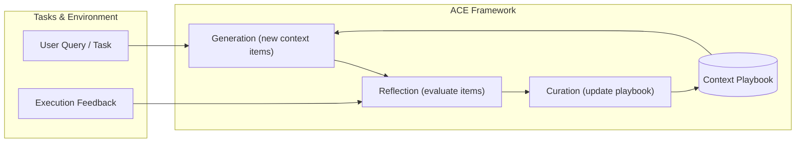
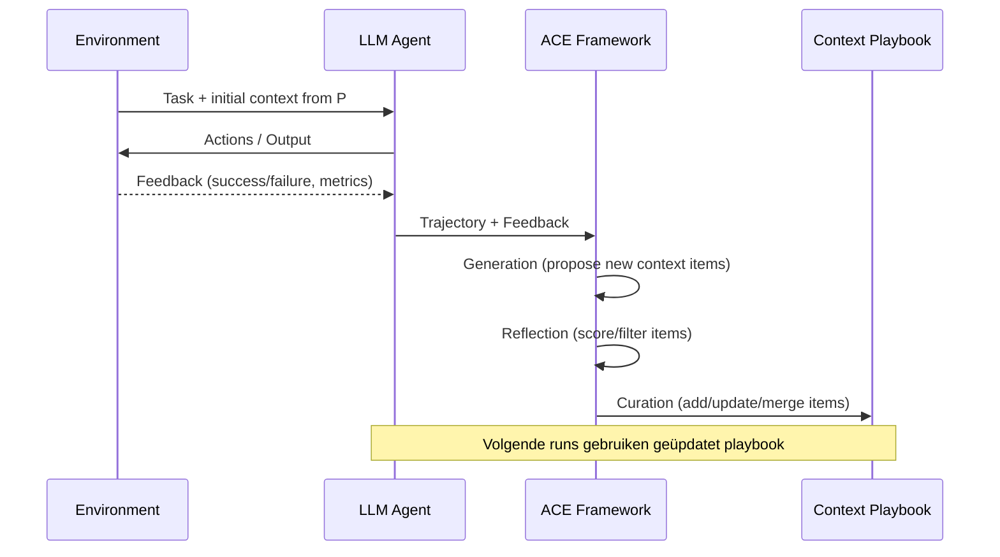

# Agentic Context Engineering (ACE)

_Evolving Contexts for Self‑Improving Language Models_

## 1. Doel en context

ACE (Agentic Context Engineering) gaat over **context aanpassen in plaats van model‑weights trainen**.

Doel:

- Context (prompts, memory, evidence) zien als **evoluerende playbooks**.
- Die playbooks **structureel verbeteren** op basis van echte execution‑feedback.
- Dat doen met een **agentische workflow** (generation → reflection → curation) in plaats van losse prompt‑tweaks.

Use‑cases:

- LLM‑agents (multi‑step, tool use, omgeving).
- Domein‑specifieke taken (bv. finance, legal) waar je veel heuristieken en tactieken nodig hebt.

Bron:

- Q. Zhang et al., _Agentic Context Engineering: Evolving Contexts for Self‑Improving Language Models_, arXiv:2510.04618, 2025.  
  <https://arxiv.org/abs/2510.04618>

---

## 2. Problemen die ACE oplost

### 2.1 Brevity bias

Veel bestaande prompt/context‑optimizers streven naar:

- **Korte, generieke samenvattingen**.
- Handig voor benchmarks, maar fout in praktijk:
  - domein‑heuristieken verdwijnen,
  - concrete foutpatronen en tool‑tips vallen weg.

Gevolg: de context wordt "mooi kort", maar **verliest domein‑intelligentie**.

### 2.2 Context collapse

Iteratief "her‑schrijven" van context door een LLM:

- na elke iteratie wordt de context:
  - korter,
  - abstracter,
  - minder concreet.
- op termijn stort de kwaliteit in (context collapse).

Voor agenten en kennis‑intensieve taken is dat dodelijk: je wilt juist **meer rijke kennis**, niet minder.

---

## 3. Kern‑idee van ACE

ACE behandelt context als een **evoluerend playbook**:

- **Niet**: één samenvattende prompt.
- **Wel**: een groeiende verzameling strategieën, voorbeelden, waarschuwingen, patterns.

Belangrijke principes:

- **Grow‑and‑refine**:
  - nieuwe inzichten toevoegen (grow),
  - oude entries herstructureren/opschonen (refine),
  - maar geen brute "overschrijf alles" updates.
- **Modulaire workflow**:
  - generation → reflection → curation.
- **Structurele, incrementele updates**:
  - kleine wijzigingen op component‑niveau,
  - voorkomen van context collapse.
- **Werkt offline én online**:
  - offline: system prompts, templates, playbooks.
  - online: agent memory, traject‑specifieke contexten.

---

## 4. ACE‑architectuur (hoog niveau)

ACE bouwt voort op de agent‑architectuur van _Dynamic Cheatsheet_ en voegt daar een strakkere context‑workflow omheen.

Belangrijke componenten:

- **Context Store / Playbook**  
  Opslag van alle context‑snippets, strategieën, voorbeelden.
- **Generation module**  
  Genereert nieuwe context‑items uit trajecten (successen, fouten, logs).
- **Reflection module**  
  Evalueert of een nieuw/oud item nuttig is:
  - is het correct?
  - voegt het iets toe?
  - overlapt het met bestaande kennis?
- **Curation module**  
  Beslist:
  - toevoegen,
  - updaten,
  - samenvoegen,
  - eventueel de‑prioriteren/verwijderen.

### 4.1 Mermaid: ACE workflow (conceptueel)

- Query + huidige playbook → nieuwe context‑kandidaten.  
- Execution feedback (success/fail) → input voor Reflection.  
- Reflection + Curation → geüpdatet playbook.

---

## 5. Offline vs online context‑adaptatie

ACE ondersteunt twee hoofdmodi:

### 5.1 Offline (system prompts, templates)

- Doel:
  - betere **system prompts**,
  - betere algemene playbooks voor een taak/domein.
- Werking:
  - verzamel vele trajecten (runs),
  - destilleer daar context‑items uit,
  - bouw stap‑voor‑stap een rijk playbook.

Voorbeeld:

- Je hebt een code‑review agent.  
- ACE leert:
  - welke review‑checks altijd nuttig zijn,
  - welke instructies vaak helpen om minder fouten te maken.

### 5.2 Online (memory, test‑time adaptatie)

- Doel:
  - context aanpassen tijdens gebruik (per user/traject).
- Werking:
  - tijdens run:
    - successen/mislukkingen loggen,
    - relevante snippets naar boven halen,
    - kleine updates doen in de memory/playbook voor volgende runs.

Voorbeeld:

- Finance‑agent die telkens nieuwe edge‑cases leert.  
- In plaats van **global retraining**:
  - context verrijken met:
    - nieuwe waarschuwingen,
    - specifieke "do's & don'ts",
    - voorbeelden van goede analyses.

---

## 6. ACE update‑cyclus

De kern van ACE is de **evolutionaire update van context**.

### 6.1 Stappen

1. **Collect**  
   verzamel trajecten (queries, antwoorden, tools, uitkomsten).
2. **Propose (Generation)**  
   genereer nieuwe context‑items:
   - strategieën,
   - templates,
   - "lessons learned",
   - failure patterns.
3. **Evaluate (Reflection)**  
   is dit item:
   - correct?
   - herbruikbaar?
   - niet redundante ruis?
4. **Integrate (Curation)**  
   - toevoegen als nieuw item,
   - bestaande items bijwerken/samenvoegen,
   - eventueel items de‑prioriteren.

### 6.2 Mermaid: update‑loop

---

## 7. Resultaten (hoog niveau)

Uit het paper:

- **Agents**:  
  ~**+10.6%** gemiddelde verbetering t.o.v. sterke baselines.
- **Domein‑specifiek (finance)**:  
  ~**+8.6%** verbetering.
- **Latency & cost**:  
  lagere adaptatie‑latency en lagere rollout‑kosten.
- **Geen gelabelde data nodig**:  
  ACE kan context verbeteren puur op:
  - environment / execution feedback,
  - zonder expliciete labels.

Op de **AppWorld leaderboard**:

- ACE evenaart de top‑productie‑agent op overall average.
- ACE is **beter op de moeilijkere test‑challenge split**,
- ondanks dat ACE een **kleiner open‑source model** gebruikt.

---

## 8. Conceptuele kern in één zin

> In plaats van één perfecte prompt, bouwt ACE een **levend context‑playbook** dat continu wordt aangevuld en aangescherpt via agentische generatie, reflectie en curatie, gestuurd door echte execution‑feedback.
