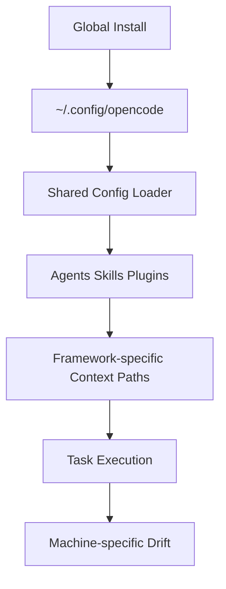
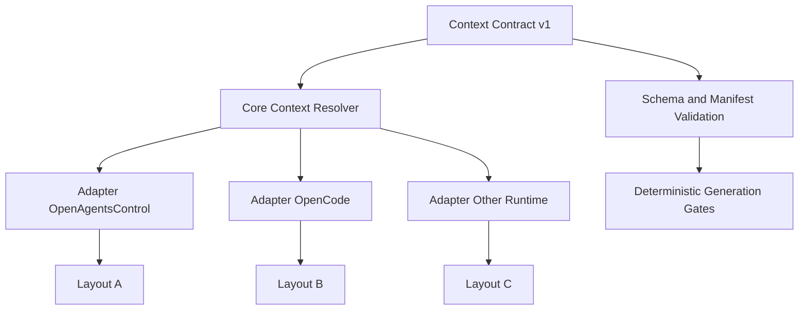
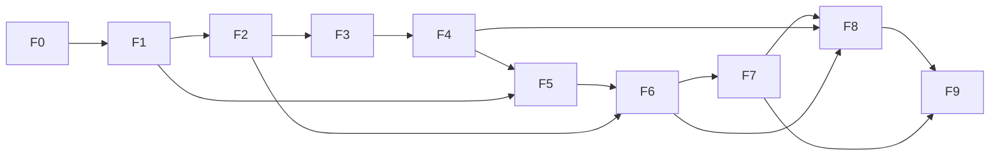
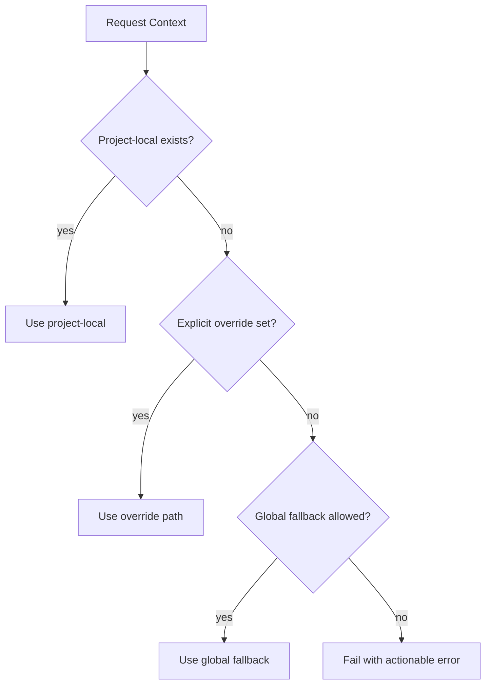
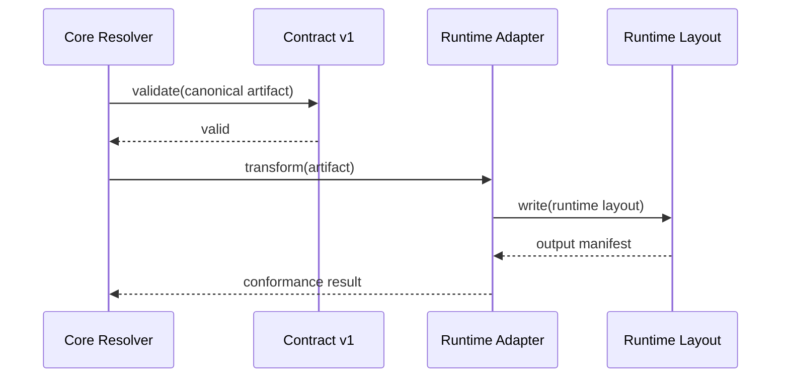

# Framework-Agnostic Context Redesign - Ultra-Grondige Uitwerking

## Doel en richting

Dit document werkt alle stappen uit om OpenAgentsControl diepgaand te analyseren en daarna de contextlogica framework-agnostisch te redesignen conform OpenCode design patterns.

Waarom dit nodig is:

- Global install maakt global state leidend, terwijl project-local gedrag voorspelbaarder is.
- Context output is niet altijd deterministisch over meerdere machines.
- Current required-context paden zijn hard gekoppeld aan frameworklogica.
- Hergebruik buiten dit framework is daardoor beperkt (vendor lock-in effect).

Wat dit plan oplevert:

- Volledig inzicht in agents, commands, skills, tools, plugins, config en installflow.
- Bewijsbare lock-in hotspots met prioriteit en risico.
- Canoniek, framework-onafhankelijk contextcontract (`Context Contract v1`).
- Adapterarchitectuur om meerdere runtimes te ondersteunen zonder core lock-in.
- Migratiepad met backward compatibility en meetbare quality gates.

## Scope

In scope:

- `AGENTS.md` en `docs/opencode/AGENTS.md` als start van component discovery.
- Shared config stack (`opencode.config.yaml` en `src/lib/config/*`).
- Agent registraties, tool/hook patterns, install/deploy scripts, context generation flow.
- Local vs global context resolutiegedrag.

Out of scope (fase 1 t/m 4):

- Directe grote refactor in productiecode.
- Breaking API-wijzigingen zonder compatibiliteitslaag.

## Succescriteria

Dit traject is geslaagd als onderstaande criteria gehaald zijn:

- Zelfde input geeft dezelfde context-output op alle ondersteunde OS-omgevingen.
- Core contextgenerator bevat geen framework-specifieke paden.
- Minimaal 2 adapters draaien conformance tests tegen hetzelfde contract.
- Legacy flow blijft werken gedurende migratieperiode.

## Programmastructuur

Werk in drie parallelle werkstromen:

- `WS-A` Analyse en bewijs: inventory, contracts, flow, determinisme.
- `WS-B` Architectuur en ontwerp: contract v1, adapters, policy's.
- `WS-C` Migratie en adoptie: dual output, compat, CI gates, rollout.

## Fase 0 - Scope, baselines en meetprotocol

Doel:

- Eenduidig startpunt maken, zodat alle volgende analyses vergelijkbaar zijn.

Kernvragen:

- Welke systemen en componenten vallen exact binnen de analyse?
- Welke omgevingsvariabelen mogen variëren en welke niet?

Activiteiten:

1. Definieer analysegrenzen in een `scope.md`.
2. Leg baseline-omgevingen vast (minimaal 2, liefst 3): Linux, macOS, Windows/WSL.
3. Leg meetprotocol vast:
   - vaste scenario-inputs
   - vaste uitvoervolgorde
   - vaste compare-methode (tree + hash + manifest)
4. Definieer bewijsopslag (evidence map per run).

Deliverables:

- `analysis/baseline/scope.md`
- `analysis/baseline/environments.md`
- `analysis/baseline/measurement-protocol.md`

Exit criteria:

- Iedereen gebruikt dezelfde scenario-inputset.
- Variabelen die output beinvloeden zijn gedocumenteerd.

## Fase 1 - Complete inventory en systeemkaart

Doel:

- 100% zicht krijgen op alle relevante bouwblokken en hun interacties.

Kernvragen:

- Welke componenten bestaan er echt (niet alleen gedocumenteerd)?
- Waar zitten entrypoints, dependencies en side effects?

Activiteiten:

1. Bouw componentcatalogus met records voor:
   - agents
   - commands
   - skills
   - tools
   - plugins
   - config modules
2. Registreer per component:
   - identifier
   - owner/type
   - entrypoint
   - input/output contract
   - permissions/tooling
   - file-system side effects
3. Maak systeemkaart op drie niveaus:
   - logisch (capabilities)
   - technisch (module dependencies)
   - runtime (triggered flows)

Deliverables:

- `analysis/inventory/components.csv`
- `analysis/inventory/system-map-logical.mmd`
- `analysis/inventory/system-map-runtime.mmd`

Exit criteria:

- Geen onbekende componenten meer in runtime traces.
- Elk component is tracebaar naar code en documentatie.

## Fase 2 - Contract extractie (expliciet en impliciet)

Doel:

- Alle harde en verborgen aannames expliciet maken.

Kernvragen:

- Welke paden en bestanden zijn hard vereist?
- Welke invarianten veroorzaken lookup failures of lock-in?

Activiteiten:

1. Extraheer contracts uit docs en code:
   - padverwachtingen
   - required file names
   - naming rules (`id == name`)
   - model resolution/fallback pipeline
2. Label elk contract:
   - documented
   - implicit-in-code
   - legacy/accidental
3. Voeg impactlabels toe:
   - portability risk
   - determinism risk
   - migration complexity

Deliverables:

- `analysis/contracts/contract-register.md`
- `analysis/contracts/invariants.md`
- `analysis/contracts/fallback-matrix.md`

Exit criteria:

- Elk kritisch runtimegedrag heeft een expliciet contractrecord.
- Top 20 lock-in contracts zijn geprioriteerd.

## Fase 3 - Flow analyse (statisch + dynamisch)

Doel:

- Begrijpen hoe gedrag echt ontstaat in runtime, inclusief side effects.

Kernvragen:

- Waar ontstaat global state?
- Waar worden local overrides genegeerd?

Activiteiten:

1. Statische flow-analyse:
   - install -> config load -> registration -> execution.
2. Dynamische trace-runs op baseline scenario's:
   - local-only project
   - global install aanwezig
   - mixed mode (local + global)
3. Leg side effects vast:
   - file writes
   - read precedence
   - fallback jumps

Deliverables:

- `analysis/flows/as-is-sequence.mmd`
- `analysis/flows/runtime-traces/*.json`
- `analysis/flows/side-effects.md`

Exit criteria:

- Voor elk scenario is er een gevalideerde sequence.
- Global/local precedence is bewijsbaar vastgelegd.

## Fase 4 - Determinisme-audit (multi-machine)

Doel:

- Vaststellen waarom outputstructuur per machine afwijkt.

Kernvragen:

- Welke factoren veroorzaken drift?
- Welke drift is functioneel schadelijk?

Activiteiten:

1. Draai identieke scenario's op alle baselines.
2. Vergelijk per run:
   - directory tree diff
   - content hash diff
   - manifest metadata diff
3. Classificeer root cause:
   - env differences
   - path normalization
   - defaults/version skew
   - ordering nondeterminism
4. Koppel root cause aan concrete mitigatie.

Deliverables:

- `analysis/determinism/drift-report.md`
- `analysis/determinism/hash-compare.csv`
- `analysis/determinism/root-cause-matrix.md`

Exit criteria:

- Elke drift heeft owner, fixrichting en impactscore.
- Minimaal 80% van drift is reproduceerbaar verklaard.

## Fase 5 - Coupling en lock-in scorecard

Doel:

- Kwantificeren waar frameworkafhankelijkheid de meeste schade doet.

Kernvragen:

- Welke modules blokkeren agnostische adoptie?
- Waar eerst ontkoppelen voor maximale winst?

Activiteiten:

1. Maak afhankelijkheidskaart core vs framework-specifiek.
2. Score per component op:
   - portability
   - determinism
   - overrideability
   - composability
   - testability
3. Bereken lock-in prioriteit:
   - `priority = impact * frequency * migration_feasibility_inverse`

Deliverables:

- `analysis/coupling/coupling-map.mmd`
- `analysis/coupling/lockin-scorecard.csv`
- `analysis/coupling/top-priorities.md`

Exit criteria:

- Top 10 lock-in hotspots zijn geprioriteerd en onderbouwd.

## Fase 6 - Agnostisch doelmodel (Context Contract v1)

Doel:

- Een canoniek contextmodel ontwerpen dat onafhankelijk is van runners/frameworks.

Kernvragen:

- Wat hoort in de core contractlaag?
- Wat hoort uitsluitend in adapters?

Activiteiten:

1. Definieer `Context Contract v1`:
   - schema
   - manifest
   - capability flags
   - required/optional context classes
2. Definieer resolutiepolicy:
   - project-local first
   - explicit override
   - optional global fallback
3. Leg non-goals vast:
   - geen frameworkspecifieke padnamen in core.

Deliverables:

- `design/context-contract-v1/schema.json`
- `design/context-contract-v1/spec.md`
- `design/context-contract-v1/resolution-policy.md`

Exit criteria:

- Contract is valideerbaar en adapter-neutraal.
- Alle huidige use-cases passen zonder frameworkhardcoding.

## Fase 7 - Adapterarchitectuur en referentie-adapters

Doel:

- Frameworkspecifieke verschillen isoleren in adapters.

Kernvragen:

- Welke adapter interface minimaliseert lock-in?
- Welke mappingregels zijn stabiel genoeg voor versioning?

Activiteiten:

1. Ontwerp adapter API:
   - input: canonical context artifact
   - output: runtime-specifieke layout
2. Bouw minimaal twee referentie-adapters (bijv. OpenAgentsControl en OpenCode).
3. Schrijf adapter conformance tests tegen contract v1.

Deliverables:

- `design/adapters/adapter-api.md`
- `src/adapters/<runtime>/...`
- `tests/conformance/adapter-*.spec.*`

Exit criteria:

- Twee adapters slagen op dezelfde conformance suite.
- Core hoeft niet te weten welke runtime gebruikt wordt.

## Fase 8 - Migratieplan en compatibiliteit

Doel:

- Overstappen zonder gebruikers of bestaande flows te breken.

Kernvragen:

- Hoe migreren we veilig van legacy layout naar canonical model?
- Welke periode is nodig voor dual support?

Activiteiten:

1. Definieer dual-output modus:
   - legacy layout
   - canonical layout
2. Bouw migratiecheckers:
   - structurele equivalentie
   - semantische equivalentie
3. Plan releases:
   - alpha: opt-in
   - beta: default met fallback
   - GA: canonical default, legacy gedepricieerd

Deliverables:

- `migration/plan.md`
- `migration/checkers/*`
- `migration/compat-matrix.md`

Exit criteria:

- Geen blocker issues in dual-run pilot.
- Duidelijke deprecationdatum en rollbackpad.

## Fase 9 - Governance, CI gates en operationele borging

Doel:

- Continu kwaliteitsniveau afdwingen na migratie.

Kernvragen:

- Hoe voorkomen we regressie naar framework-lock-in?
- Welke tests moeten hard failen in CI?

Activiteiten:

1. CI quality gates:
   - contract schema validation
   - deterministic generation test
   - adapter conformance tests
2. Governance-afspraken:
   - architectuur review bij nieuwe contextfeature
   - lock-in lint rules
   - changelog discipline per contractversie
3. Operatie:
   - incident template voor drift/fallback bugs
   - maandelijkse conformiteitsreview

Deliverables:

- `.github/workflows/context-conformance.yml`
- `governance/context-architecture-rules.md`
- `governance/release-checklist.md`

Exit criteria:

- CI blokkeert non-conforme wijzigingen automatisch.
- Team kan nieuwe runtimes toevoegen zonder core wijziging.

## Multidimensionale analysematrix (invulbaar)

Gebruik per component onderstaande score (1 laag, 5 hoog):

| Dimensie         | Vraag                                      | Score (1-5) | Evidence |
| ---------------- | ------------------------------------------ | ----------- | -------- |
| Functioneel      | Doet het wat het belooft?                  |             |          |
| Structureel      | Is outputlayout contract-conform?          |             |          |
| Gedragsmatig     | Is runtimevolgorde voorspelbaar?           |             |          |
| Configuratie     | Gebruikt het shared config correct?        |             |          |
| Portabiliteit    | Werkt het gelijk op local/global/multi-PC? |             |          |
| Coupling         | Hoeveel frameworkafhankelijkheid is er?    |             |          |
| Determinisme     | Zelfde input -> zelfde output?             |             |          |
| Observability    | Genoeg logging/manifest/tracing?           |             |          |
| Security         | Least privilege toegepast?                 |             |          |
| Evolueerbaarheid | Uitbreidbaar zonder breuk?                 |             |          |

## Evidence templates

### A) Component record

```text
component_id:
type:
entrypoint:
dependencies:
inputs:
outputs:
side_effects:
hardcoded_paths:
fallback_chain:
permissions:
known_risks:
```

### B) Contract record

```text
contract_id:
statement:
source: documented | implicit-in-code | legacy
severity: critical | high | medium | low
breakage_if_violated:
evidence_files:
proposed_normalization:
```

### C) Drift report record

```text
run_id:
machine:
scenario:
diff_type: tree | hash | manifest
root_cause:
impact:
mitigation:
owner:
target_release:
```

## Diagrammen

### 1) As-is lock-in situatie



### 2) Doelarchitectuur (agnostisch + adapters)



### 3) Fase afhankelijkheden



### 4) Resolutiepolicy (local first)



### 5) Adapter sequence



## Ideebord voor agnostische redesign

Prioriteit `P1`:

- Canonical `context.manifest.yaml` met versie en capability flags.
- Path abstraction layer in core (geen runtimepaden in businesslogica).
- Deterministic generator mode (fixed ordering, normalized paths, stable templates).

Prioriteit `P2`:

- Adapter SDK met testkit voor nieuwe runtimes.
- CLI `context doctor` voor drift-diagnose.
- Compatibility adapter voor legacy `.opencode/context/*` consumers.

Prioriteit `P3`:

- Visual graph explorer voor contracten en coupling.
- Auto-migration assistant met dry-run rapport.

## Praktisch uitvoerplan (eerste 14 dagen)

Dag 1-2:

- Fase 0 afronden (scope, protocol, baselines).
- Start inventory skeleton.

Dag 3-5:

- Fase 1 en 2 afronden (componenten + contractregister).
- Eerste lock-in shortlist publiceren.

Dag 6-8:

- Fase 3 traces en fase 4 determinisme-audit uitvoeren.
- Root-cause matrix met mitigaties opstellen.

Dag 9-11:

- Fase 5 scorecard en prioriteiten beslissen.
- Fase 6 concept `Context Contract v1` schrijven.

Dag 12-14:

- Fase 7 adapter API draft + conformance testplan.
- Fase 8 migratie outline en fase 9 CI-gates voorstel.

## Beslisgates

Gebruik deze gates om kwaliteit te borgen:

- `Gate A` na fase 2: contractdekking >= 90% van runtimekritieke paden.
- `Gate B` na fase 4: drift oorzaken geclassificeerd met mitigationplan.
- `Gate C` na fase 6: contract v1 review akkoord door architectuurverantwoordelijke.
- `Gate D` na fase 8: dual-run pilot zonder kritieke regressie.

## Startpunt voor brainstorm sessie

Gebruik deze vragen direct in de volgende sessie:

1. Welke drie contracts veroorzaken de meeste lock-in per vandaag?
2. Welke minimale adapter-interface geeft al 80% portability winst?
3. Welke legacy features mogen niet breken in dual-run?
4. Welke CI gate levert de hoogste preventieve waarde tegen regressie?
