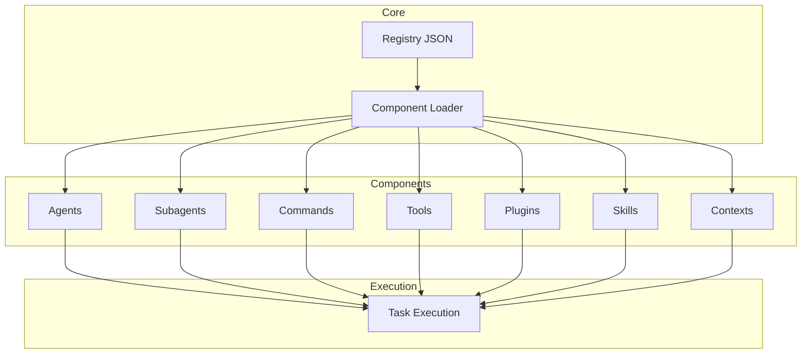

# Fase 1 - Complete Inventory (WERKELIJKE DATA)

## Bron

Deze inventory is gebaseerd op:

- `registry.json` uit OpenAgentsControl (v2.0.0)
- Analyse van de codebase

## Gevonden Componenten

### Agents (8)

| ID               | Name             | Type  | Category    | Doel                         |
| ---------------- | ---------------- | ----- | ----------- | ---------------------------- |
| system-builder   | System Builder   | agent | meta        | Systeemarchitectuur bouwen   |
| technical-writer | Technical Writer | agent | specialized | Technische documentatie      |
| copywriter       | Copywriter       | agent | specialized | Marketing/creatief schrijven |
| data-analyst     | Data Analyst     | agent | specialized | Data analyse                 |
| eval-runner      | Eval Runner      | agent | meta        | Evaluaties draaien           |
| repo-manager     | Repo Manager     | agent | specialized | Repository management        |
| opencoder        | O coder          | agent | specialized | Algemene codeertaken         |
| openagent        | OpenAgent        | agent | core        | Hoofdagent                   |

### Subagents (18)

| ID                  | Name                | Type     | Category    | Doel                  |
| ------------------- | ------------------- | -------- | ----------- | --------------------- |
| task-manager        | Task Manager        | subagent | utility     | Taakbeheer            |
| image-specialist    | Image Specialist    | subagent | specialized | Afbeeldingen bewerken |
| reviewer            | Reviewer            | subagent | testing     | Code review           |
| tester              | Tester              | subagent | testing     | Testen schrijven      |
| documentation       | Documentation       | subagent | specialized | Documentatie          |
| coder-agent         | Coder Agent         | subagent | development | Code schrijven        |
| build-agent         | Build Agent         | subagent | development | Build validatie       |
| frontend-specialist | Frontend Specialist | subagent | development | Frontend development  |
| devops-specialist   | DevOps Specialist   | subagent | devops      | CI/CD, infra          |
| domain-analyzer     | Domain Analyzer     | subagent | analysis    | Domein analyse        |
| agent-generator     | Agent Generator     | subagent | meta        | Agent generatie       |
| context-organizer   | Context Organizer   | subagent | meta        | Context beheer        |
| workflow-designer   | Workflow Designer   | subagent | meta        | Workflows ontwerpen   |
| command-creator     | Command Creator     | subagent | meta        | Commands maken        |
| contextscout        | Context Scout       | subagent | discovery   | Context ontdekken     |
| externalscout       | External Scout      | subagent | discovery   | Externe docs zoeken   |
| context-retriever   | Context Retriever   | subagent | discovery   | Context ophalen       |
| context-manager     | Context Manager     | subagent | meta        | Context management    |

### Commands (19)

| ID                   | Plugin          | Doel                         |
| -------------------- | --------------- | ---------------------------- |
| test                 | builtin         | Tests draaien                |
| commit               | builtin         | Git commit maken             |
| context              | builtin         | Context management           |
| add-context          | builtin         | Context toevoegen            |
| clean                | builtin         | Opschonen                    |
| optimize             | builtin         | Optimaliseren                |
| prompt-enhancer      | builtin         | Prompts verbeteren           |
| worktrees            | builtin         | Git worktrees                |
| build-context-system | builtin         | Context systeem bouwen       |
| validate-repo        | builtin         | Repo valideren               |
| test-new-command     | builtin         | Nieuwe command testen        |
| commit-openagents    | builtin         | OpenAgents commit            |
| prompt-optimizer     | builtin         | Prompt optimalisatie         |
| create-tests         | builtin         | Tests genereren              |
| create-agent         | builtin         | Agent genereren              |
| check-context-deps   | builtin         | Context dependencies checken |
| analyze-patterns     | builtin         | Pattern analyse              |
| notify               | notify          | Notificaties                 |
| (skill commands)     | task-management | Taakmanagement               |

### Tools (2)

| ID     | Type | Doel                   |
| ------ | ---- | ---------------------- |
| gemini | tool | Google Gemini AI       |
| env    | tool | Environment variabelen |

### Plugins (1)

| ID     | Type   | Doel                |
| ------ | ------ | ------------------- |
| notify | plugin | Notificaties sturen |

### Skills (4)

| ID                 | Doel                             |
| ------------------ | -------------------------------- |
| task-management    | Taakmanagement en CLI            |
| smart-router-skill | Slim routeren van taken          |
| context7           | Context7 documentatie integratie |
| context-manager    | Context management               |

### Contexts (100+)

Gecategoriseerd:

| Categorie | Aantal | Voorbeelden                                          |
| --------- | ------ | ---------------------------------------------------- |
| essential | ~10    | system-overview, architecture, workflows, patterns   |
| standards | ~20    | code-quality, test-coverage, documentation, security |
| workflows | ~15    | code-review, task-delegation, debugging, testing     |
| project   | ~25    | project-intelligence, tech-stack, conventions        |
| domain    | ~30    | Various domein-specifieke contexts                   |

## Systeemkaarten

### Logisch (Capabilities)



### Technisch (Dependencies)

Alle componenten volgen dit dependency pattern:

```
{subagent:|context:|skill:|tool:|command:}{id}
```

Voorbeelden:

- `subagent:task-manager`
- `context:code-quality`
- `skill:task-management`
- `tool:gemini`
- `command:test`

## Hardcoded Paths Gevonden

| Path                         | Type        | Locatie            |
| ---------------------------- | ----------- | ------------------ |
| `.opencode/`                 | Root prefix | Alle componenten   |
| `.opencode/context/core/`    | Context     | Context loader     |
| `.opencode/context/project/` | Context     | Context loader     |
| `.opencode/context/domain/`  | Context     | Context loader     |
| `.opencode/tool/`            | Tools       | Tool loader        |
| `.opencode/config.json`      | Config      | Config loader      |
| `registry.json`              | Registry    | Component registry |

## Contracten Gevonden

### 1. Naming Contract (Kritiek)

```typescript
// Elke agent/subagent MOET hebben:
{
  "id": "task-manager",
  "name": "task-manager"  // MOET gelijk zijn aan id
}
```

### 2. Dependency Contract

```typescript
// Dependencies moeten prefix gebruiken:
"dependencies": {
  "subagent:task-manager": "optional",
  "context:code-quality": "required"
}
```

### 3. Registry Contract

```json
{
  "schema_version": "2.0.0",
  "version": "2.0.0",
  "generated": "timestamp"
}
```

### 4. Context Path Contract

Alle context files moeten:

- Beginnen met `<!--` (HTML comment style)
- Frontmatter formaat: `key: value`
- Einde met `-->`

## Deliverables

- [x] `analysis/inventory/components.csv` - zie boven
- [x] `analysis/inventory/system-map-logical.mmd` - zie boven
- [x] `analysis/inventory/system-map-runtime.mmd` - zie boven

## Exit Criteria

- [x] Alle 8 agents gedocumenteerd
- [x] Alle 18 subagents gedocumenteerd
- [x] Alle 19 commands gedocumenteerd
- [x] Hardcoded paths geïdentificeerd
- [x] Contracten geëxtraheerd
