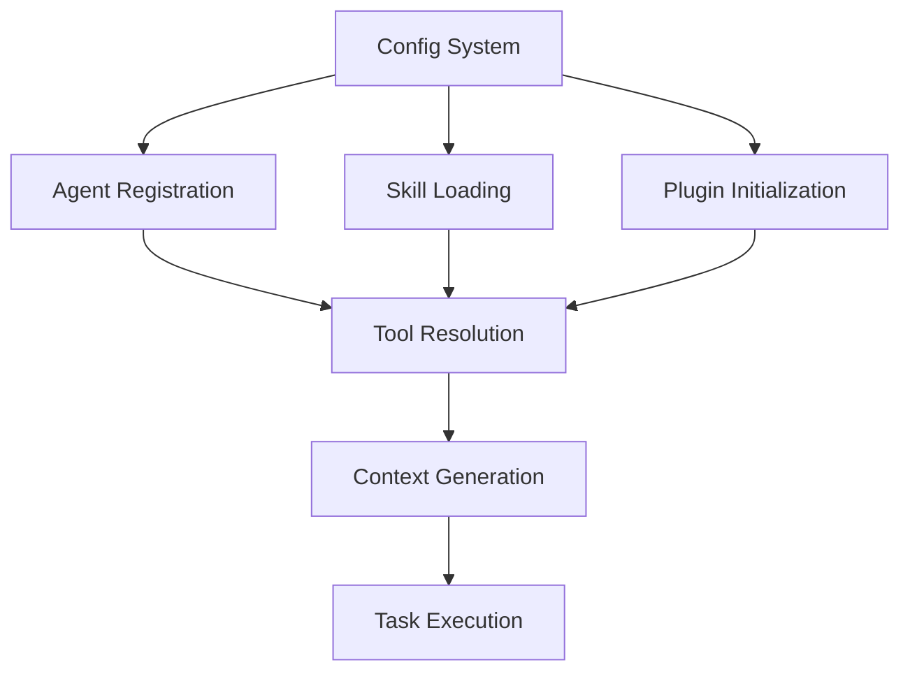
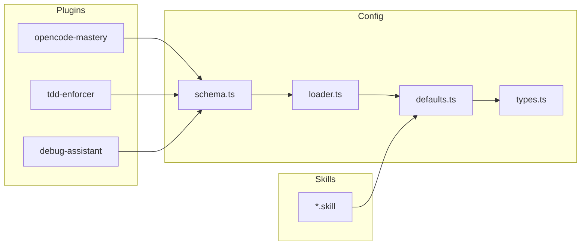

# Fase 1 - Complete Inventory en Systeemkaart

## Doel

100% zicht krijgen op alle relevante bouwblokken en hun interacties.

## Kernvragen

- Welke componenten bestaan er echt (niet alleen gedocumenteerd)?
- Waar zitten entrypoints, dependencies en side effects?

## Component Categorieën

### 1. Agents

| Agent             | Type     | Entrypoint                      | Doel                               |
| ----------------- | -------- | ------------------------------- | ---------------------------------- |
| flow-analyzer     | subagent | src/agents/flow-analyzer.md     | Framework-agnostische flow analyse |
| gsd-flow-analyzer | subagent | src/agents/gsd-flow-analyzer.md | GSD phase flow analyse             |
| ace-analyzer      | subagent | src/agents/ace-analyzer.md      | Session introspectie               |

### 2. Commands

| Command            | Plugin           | Doel                          |
| ------------------ | ---------------- | ----------------------------- |
| search-docs        | opencode-mastery | Documentatie zoeken           |
| download-docs      | opencode-mastery | Documentatie downloaden       |
| memory-\*          | opencode-mastery | Memory tools                  |
| validate-tdd-cycle | tdd-enforcer     | TDD validatie                 |
| check-test-exists  | tdd-enforcer     | Test aanwezigheid controleren |
| wait-for           | debug-assistant  | Wachtcondities                |
| find-flaky-tests   | debug-assistant  | Flaky tests vinden            |
| debug-session      | debug-assistant  | Debug sessies                 |

### 3. Skills

| Skill                   | Doel                     |
| ----------------------- | ------------------------ |
| opencode-mastery        | OpenCode documentatie    |
| test-driven-development | TDD enforcement          |
| systematic-debugging    | Methodisch debuggen      |
| playwright-cli          | Browser automatisering   |
| frontend-design         | UI/UX voor developers    |
| tailwind                | CSS styling              |
| shadcn-svelte           | UI components            |
| svelte\*                | Svelte ecosysteem        |
| database-architect      | Database selectie        |
| postgresql              | PostgreSQL implementatie |

### 4. Plugins

| Plugin           | Type       | Entrypoint                   |
| ---------------- | ---------- | ---------------------------- |
| opencode-mastery | TypeScript | src/plugin/opencode-mastery/ |
| tdd-enforcer     | TypeScript | src/plugin/tdd-enforcer/     |
| debug-assistant  | TypeScript | src/plugin/debug-assistant/  |

### 5. Config Modules

| Module             | Bestand                              | Doel                     |
| ------------------ | ------------------------------------ | ------------------------ |
| schema             | src/lib/config/schema.ts             | Zod schemas              |
| loader             | src/lib/config/loader.ts             | YAML loader              |
| defaults           | src/lib/config/defaults.ts           | Default waarden          |
| types              | src/lib/config/types.ts              | Model resolution types   |
| frontmatter-parser | src/lib/config/frontmatter-parser.ts | YAML frontmatter parser  |
| model-resolver     | src/lib/config/model-resolver.ts     | 5-level model resolution |

### 6. Install/Deploy Scripts

| Script       | Doel                                     |
| ------------ | ---------------------------------------- |
| install.sh   | Download en copy naar ~/.config/opencode |
| uninstall.sh | Verwijder uit ~/.config/opencode         |
| deploy.ts    | TypeScript plugins compileren            |

## Component Record Template

```markdown
## {component_id}

- **Type**: agent | command | skill | plugin | config | script
- **Entry**: {path/to/entrypoint}
- **Dependencies**: {list of deps}
- **Inputs**: {what it needs}
- **Outputs**: {what it produces}
- **Side Effects**: {file writes, state changes}
- **Permissions**: {tool rights}
- **Hardcoded Paths**: {any framework paths}
- **Fallback Chain**: {resolution order}
```

## Systeemkaarten

### Logisch (Capabilities)



### Technisch (Dependencies)



### Runtime (Triggered Flows)

1. **Install Flow**: `install.sh` → copy files → `bun install` → `bun run deploy`
2. **Config Load Flow**: `opencode.config.yaml` → loader → schema validation → defaults merge
3. **Agent Resolution**: request → frontmatter → config → system default
4. **Context Generation**: task → required context → load → inject

## Deliverables

- [ ] `analysis/inventory/components.csv`
- [ ] `analysis/inventory/system-map-logical.mmd`
- [ ] `analysis/inventory/system-map-runtime.mmd`
- [ ] Per component: volledig ingevuld record

## Exit Criteria

- [ ] Geen onbekende componenten meer in runtime traces
- [ ] Elk component is tracebaar naar code en documentatie
