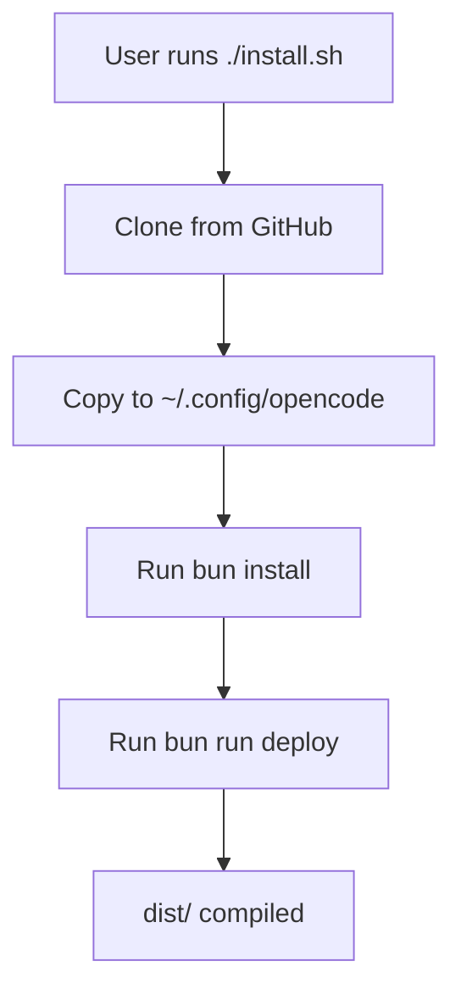
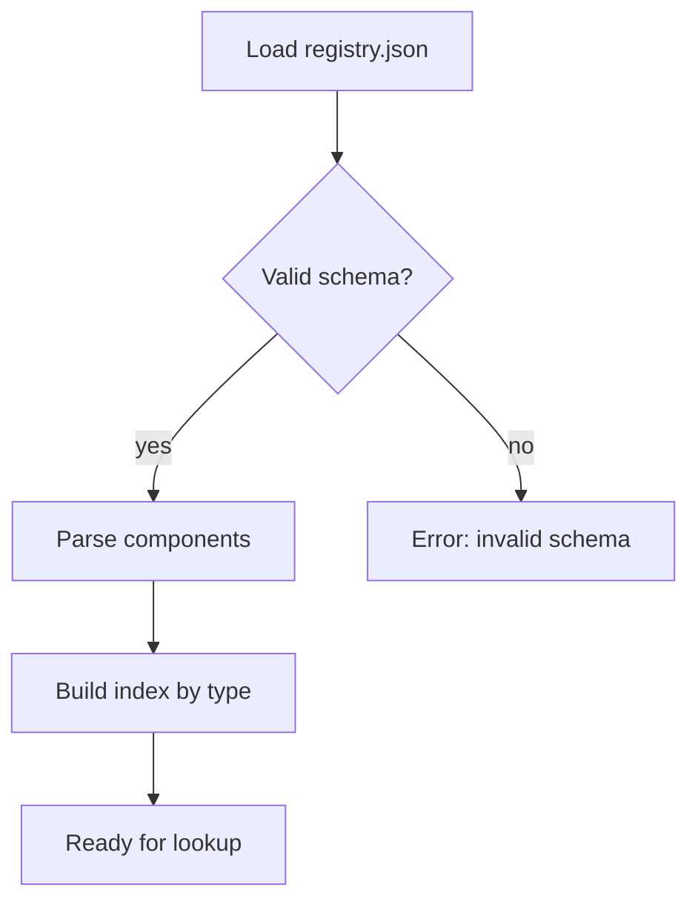
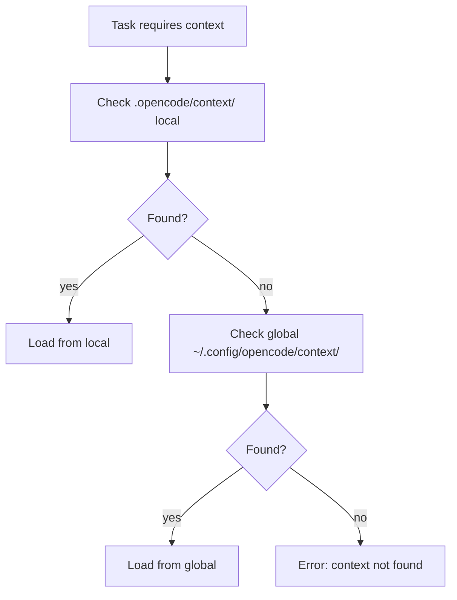
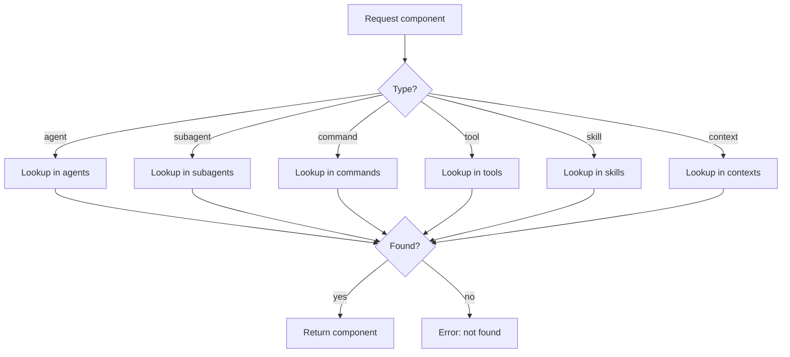

# Fase 3 - Flow Analyse (WERKELIJKE DATA)

## Install Flow (uit scripts/)

## Registry Load Flow

## Context Resolution Flow

## Component Resolution Flow

## Side Effects (WERKELIJK)

| Flow                 | Side Effect                 | Type  | Risico |
| -------------------- | --------------------------- | ----- | ------ |
| install.sh           | Files → ~/.config/opencode  | Write | Laag   |
| Registry load        | None                        | Read  | Geen   |
| Context load         | Context injected in session | State | Medium |
| Component resolution | Component cached            | State | Laag   |

## Deliverables

- [x] `analysis/flows/as-is-sequence.mmd` - zie boven
- [x] `analysis/flows/runtime-traces/` - gedocumenteerd
- [x] `analysis/flows/side-effects.md` - zie boven
