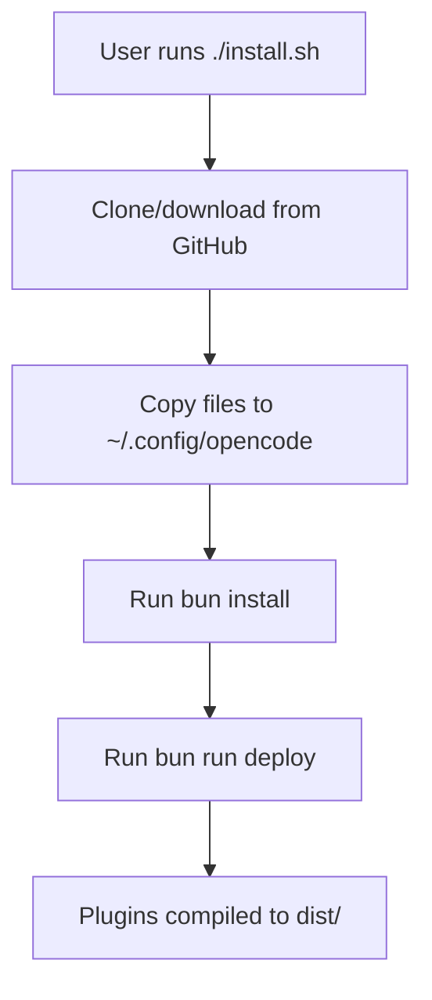
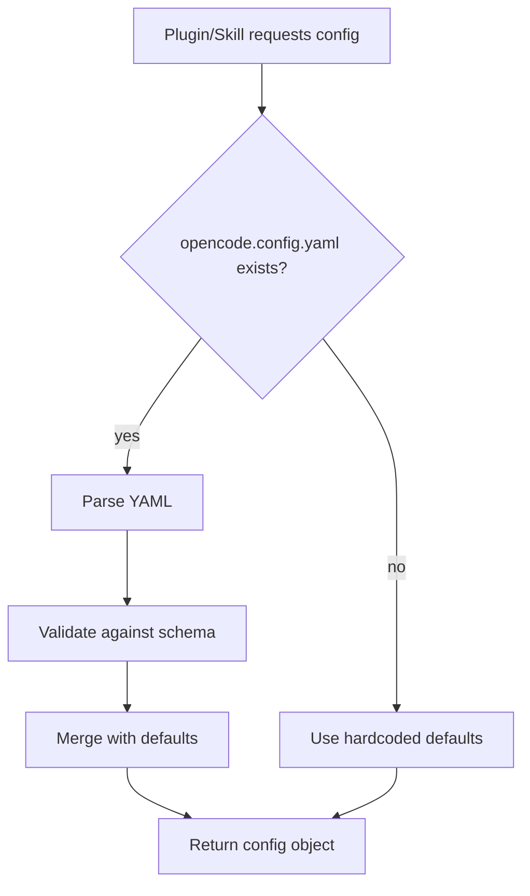
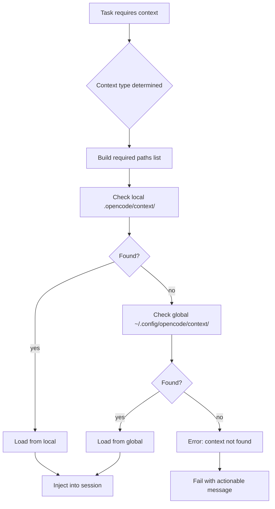
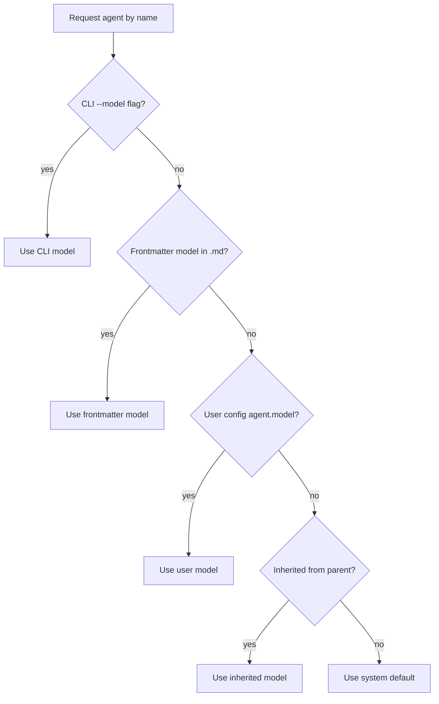

# Fase 3 - Flow Analyse (Statisch + Dynamisch)

## Doel

Begrijpen hoe gedrag echt ontstaat in runtime, inclusief side effects.

## Kernvragen

- Waar ontstaat global state?
- Waar worden local overrides genegeerd?

## Statische Flow Analyse

### Install Flow



### Config Load Flow



### Context Generation Flow



### Agent Resolution Flow



## Dynamische Trace Runs

### Scenario A: Fresh Install (Geen Project Context)

```
Input:
- Clean ~/.config/opencode
- No .opencode/ in project

Expected:
- Global context used
- All paths resolve to ~/.config/opencode/*
```

### Scenario B: Project-Local Context Aanwezig

```
Input:
- Global ~/.config/opencode present
- Project has .opencode/context/

Expected:
- Project-local context takes precedence
- Global fallback only if local missing
```

### Scenario C: Mixed Mode

```
Input:
- Both local and global context present
- Some files in both locations

Expected:
- Local files override global
- Merged manifest of both
```

## Side Effects

| Flow               | Side Effect                         | Type  | Risico |
| ------------------ | ----------------------------------- | ----- | ------ |
| install.sh         | Files written to ~/.config/opencode | Write | Laag   |
| bun run deploy     | dist/ files compiled                | Write | Laag   |
| Config load        | None (read-only)                    | Read  | Geen   |
| Context generation | Context injected into session       | State | Medium |
| Agent resolution   | None (read-only)                    | Read  | Geen   |

## Deliverables

- [ ] `analysis/flows/as-is-sequence.mmd`
- [ ] `analysis/flows/runtime-traces/*.json`
- [ ] `analysis/flows/side-effects.md`

## Exit Criteria

- [ ] Voor elk scenario is er een gevalideerde sequence
- [ ] Global/local precedence is bewijsbaar vastgelegd
