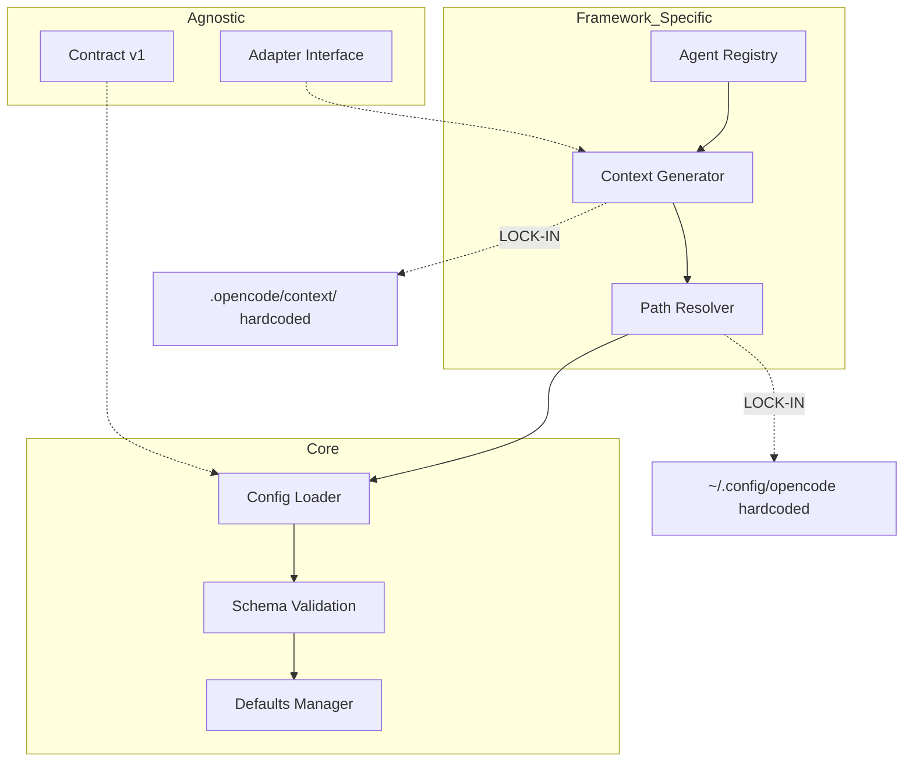

# Fase 5 - Coupling en Lock-in Scorecard

## Doel

Kwantificeren waar frameworkafhankelijkheid de meeste schade doet.

## Kernvragen

- Welke modules blokkeren agnostische adoptie?
- Waar eerst ontkoppelen voor maximale winst?

## Coupling Map



## Component Scoring Matrix

| Component      | Portability | Determinism | Overrideability | Composability | Testability | Totaal |
| -------------- | ----------- | ----------- | --------------- | ------------- | ----------- | ------ |
| schema.ts      | 5           | 5           | 3               | 5             | 4           | 22     |
| loader.ts      | 4           | 5           | 2               | 5             | 4           | 20     |
| defaults.ts    | 4           | 3           | 2               | 4             | 5           | 18     |
| Path Resolver  | 1           | 3           | 1               | 3             | 4           | 12     |
| Context Gen    | 1           | 3           | 1               | 2             | 3           | 10     |
| Agent Registry | 2           | 3           | 1               | 3             | 3           | 12     |

_Schaal: 1 (laag) - 5 (hoog)_

## Lock-in Prioriteiten

### P1 - Kritiek (Direct Ontkoppelen)

| Component                      | Lock-in Type | Impact  | Frequentie | Migratie Moeilijkheid |
| ------------------------------ | ------------ | ------- | ---------- | --------------------- |
| `~/.config/opencode` hardcoded | Path         | Kritiek | Altijd     | Medium                |
| `.opencode/context/` path      | Path         | Kritiek | Altijd     | Medium                |
| Agent `id == name` invariant   | Naming       | Hoog    | Regelmatig | Laag                  |

### P2 - Hoog (Volgende Stap)

| Component           | Lock-in Type | Impact | Frequentie | Migratie Moeilijkheid |
| ------------------- | ------------ | ------ | ---------- | --------------------- |
| Config filename     | Config       | Hoog   | Regelmatig | Laag                  |
| 5-level resolution  | Resolution   | Medium | Soms       | Hoog                  |
| bun-only deployment | Tooling      | Medium | Altijd     | Hoog                  |

### P3 - Medium (Later)

| Component          | Lock-in Type | Impact | Frequentie | Migratie Moeilijkheid |
| ------------------ | ------------ | ------ | ---------- | --------------------- |
| TypeScript plugins | Language     | Laag   | Altijd     | Medium                |
| skill/ naming      | Naming       | Laag   | Soms       | Laag                  |

## Prioriteitsformula

```
priority = impact × frequentie × (1 / migration_feasibility)
```

| Component       | Impact (1-5) | Frequentie (1-5) | Feasibility (1-5) | Prioriteit |
| --------------- | ------------ | ---------------- | ----------------- | ---------- |
| Path hardcoded  | 5            | 5                | 3                 | 8.3        |
| Context path    | 5            | 5                | 3                 | 8.3        |
| Agent naming    | 4            | 3                | 4                 | 3.0        |
| Config filename | 3            | 3                | 4                 | 2.3        |

## Deliverables

- [ ] `analysis/coupling/coupling-map.mmd`
- [ ] `analysis/coupling/lockin-scorecard.csv`
- [ ] `analysis/coupling/top-priorities.md`

## Exit Criteria

- [ ] Top 10 lock-in hotspots zijn geprioriteerd en onderbouwd
