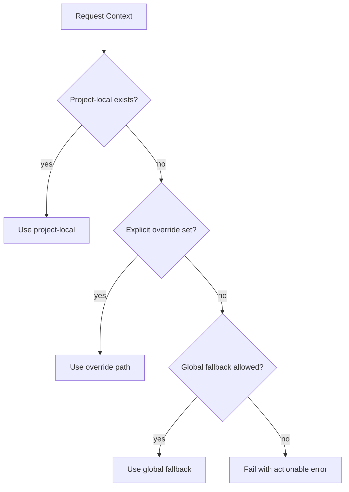
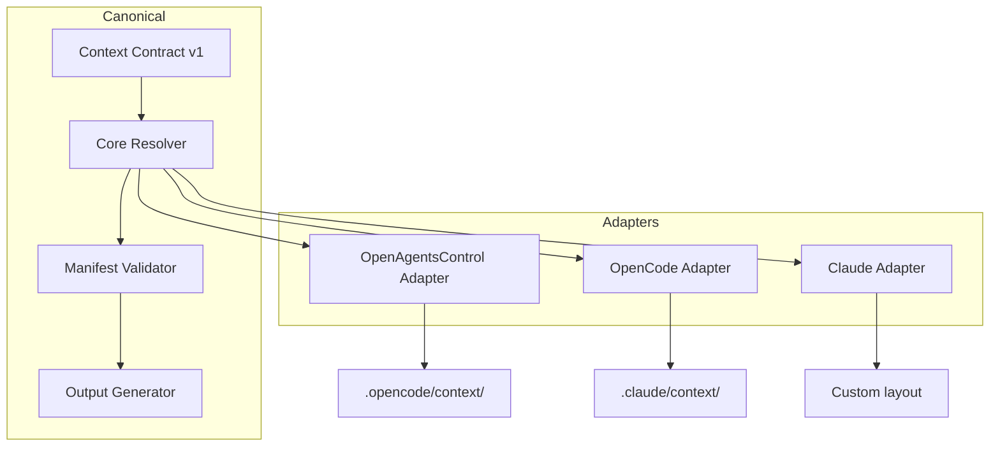

# Fase 6 - Agnostisch Doelmodel (Context Contract v1)

## Doel

Een canoniek contextmodel ontwerpen dat onafhankelijk is van runners/frameworks.

## Kernvragen

- Wat hoort in de core contractlaag?
- Wat hoort uitsluitend in adapters?

## Context Contract v1 - Schema

```json
{
  "$schema": "https://context-contract.io/v1/schema.json",
  "version": "1.0.0",
  "type": "context-manifest",
  "metadata": {
    "created": "2026-02-20T00:00:00Z",
    "generator": "context-contract-v1",
    "canonical": true
  },
  "contexts": {
    "required": [
      {
        "id": "code-quality",
        "path": "standards/code-quality.md",
        "purpose": "Code conventions and quality standards"
      },
      {
        "id": "documentation",
        "path": "standards/documentation.md",
        "purpose": "Documentation standards"
      },
      {
        "id": "test-coverage",
        "path": "standards/test-coverage.md",
        "purpose": "Test coverage requirements"
      },
      {
        "id": "code-review",
        "path": "workflows/code-review.md",
        "purpose": "Code review workflow"
      },
      {
        "id": "task-delegation",
        "path": "workflows/task-delegation-basics.md",
        "purpose": "Task delegation patterns"
      }
    ],
    "optional": [
      {
        "id": "security",
        "path": "standards/security.md",
        "purpose": "Security patterns"
      },
      {
        "id": "performance",
        "path": "standards/performance.md",
        "purpose": "Performance guidelines"
      }
    ]
  },
  "resolution": {
    "policy": "local-first",
    "fallback": "optional-global",
    "override": "explicit-only"
  },
  "capabilities": {
    "context-injection": true,
    "lazy-loading": true,
    "versioned-output": true
  }
}
```

## Resolutiepolicy



### Policy Regels

| Rule            | Description                                               |
| --------------- | --------------------------------------------------------- |
| local-first     | Altijd eerst project-local checken                        |
| explicit-only   | Override alleen via expliciete configuratie               |
| optional-global | Global fallback alleen als toegestaan in config           |
| fail-early      | Duidelijke foutmelding bij ontbrekende verplichte context |

## Non-Goals (Niet in Core)

De volgende blijven exclusief in adapters:

- Framework-specifieke padnamen (`.opencode/`, `.claude/`, etc.)
- Framework-specifieke naming conventions
- Framework-specifieke tool/hook integraties

## Doelarchitectuur



## Deliverables

- [ ] `design/context-contract-v1/schema.json`
- [ ] `design/context-contract-v1/spec.md`
- [ ] `design/context-contract-v1/resolution-policy.md`

## Exit Criteria

- [ ] Contract is valideerbaar en adapter-neutraal
- [ ] Alle huidige use-cases passen zonder frameworkhardcoding
