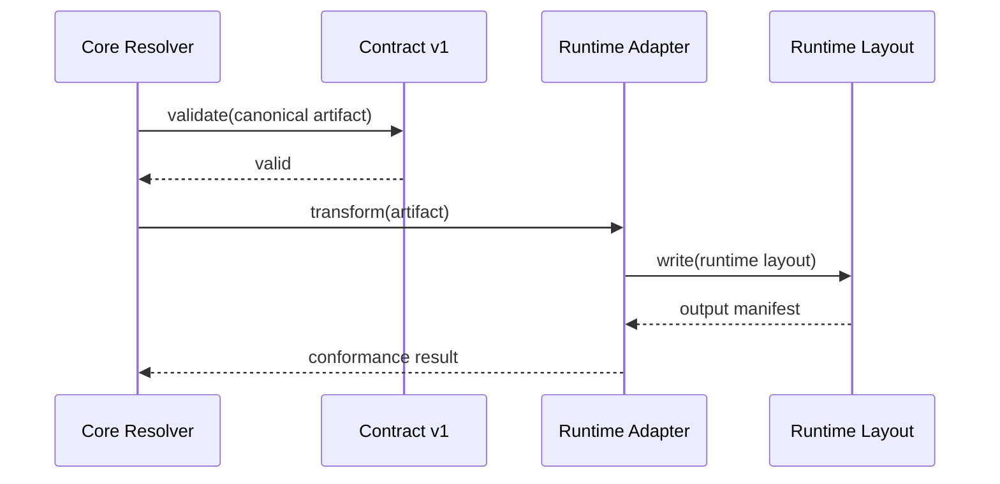

# Fase 7 - Adapterarchitectuur en Referentie-Adapters

## Doel

Framework-specifieke verschillen isoleren in adapters.

## Kernvragen

- Welke adapter interface minimaliseert lock-in?
- Welke mappingregels zijn stabiel genoeg voor versioning?

## Adapter API Ontwerp

```typescript
interface ContextAdapter {
  // Adapter identificatie
  readonly id: string;
  readonly version: string;
  readonly targetFramework: string;

  // Transformatie
  transform(canonical: CanonicalContext): Promise<FrameworkContext>;

  // Validatie
  validate(context: FrameworkContext): ValidationResult;

  // Configuratie
  getConfig(): AdapterConfig;
}

interface CanonicalContext {
  manifest: ContextManifest;
  contexts: Map<string, ContextFile>;
  resolutionPolicy: ResolutionPolicy;
}

interface FrameworkContext {
  layout: FrameworkLayout;
  paths: PathMapping[];
  metadata: FrameworkMetadata;
}
```

## Referentie Adapter: OpenAgentsControl

```typescript
class OpenAgentsControlAdapter implements ContextAdapter {
  readonly id = "openagents-control";
  readonly targetFramework = "OpenAgentsControl";

  transform(canonical: CanonicalContext): Promise<FrameworkContext> {
    return {
      layout: {
        root: ".opencode/context",
        subdirectories: ["core/standards", "core/workflows"],
      },
      paths: canonical.contexts.map((ctx) => ({
        source: ctx.path,
        target: this.mapToFrameworkPath(ctx),
      })),
      metadata: {
        generatedBy: this.id,
        frameworkVersion: "1.0.0",
      },
    };
  }

  private mapToFrameworkPath(ctx: ContextFile): string {
    // Map canonical path naar framework-specifiek pad
    return `.opencode/context/${ctx.path}`;
  }
}
```

## Referentie Adapter: OpenCode

```typescript
class OpenCodeAdapter implements ContextAdapter {
  readonly id = "opencode";
  readonly targetFramework = "OpenCode";

  transform(canonical: CanonicalContext): Promise<FrameworkContext> {
    return {
      layout: {
        root: ".opencode/context",
        subdirectories: ["standards", "workflows"],
      },
      paths: canonical.contexts.map((ctx) => ({
        source: ctx.path,
        target: this.mapToFrameworkPath(ctx),
      })),
      metadata: {
        generatedBy: this.id,
        frameworkVersion: "2.0.0",
      },
    };
  }
}
```

## Adapter Sequence Diagram



## Adapter Conformance Test

```typescript
describe("Adapter Conformance", () => {
  const adapters: ContextAdapter[] = [
    new OpenAgentsControlAdapter(),
    new OpenCodeAdapter(),
  ];

  adapters.forEach((adapter) => {
    it(`${adapter.id} should produce valid output`, async () => {
      const canonical = createTestCanonicalContext();
      const result = await adapter.transform(canonical);

      expect(result.layout.root).toBeDefined();
      expect(result.paths.length).toBe(canonical.contexts.size);
      expect(await adapter.validate(result)).toBeValid();
    });

    it(`${adapter.id} should handle missing optional contexts`, async () => {
      const canonical = createCanonicalWithMissingOptional();
      const result = await adapter.transform(canonical);

      // Should not fail on missing optional
      expect(result).toBeDefined();
    });
  });
});
```

## Deliverables

- [ ] `design/adapters/adapter-api.md`
- [ ] `src/adapters/openagents-control/`
- [ ] `src/adapters/opencode/`
- [ ] `tests/conformance/adapter.spec.ts`

## Exit Criteria

- [ ] Twee adapters slagen op dezelfde conformance suite
- [ ] Core hoeft niet te weten welke runtime gebruikt wordt
