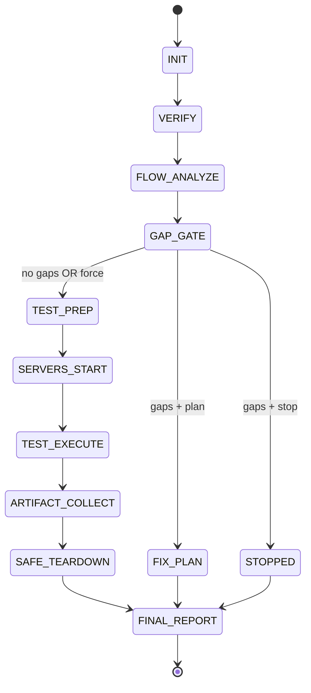

# Architecture and System Design

## 1. Design Principles

This workflow follows OpenCode-native separation of concerns:

- Commands: parse input, route, and present user-facing progress
- Plugin tools: deterministic side-effect execution with typed contracts
- Skills: policy and quality rules (severity, gating, report standards)
- Subagents: bounded specialized reasoning (flow analysis, test strategy, debug)

Software design principles applied:

- Single Responsibility Principle (SRP): each tool does one lifecycle step
- Open/Closed Principle (OCP): adapters can extend framework support without command rewrites
- Dependency Inversion Principle (DIP): orchestrator depends on tool contracts, not shell details
- Fail-safe defaults: unknown process ownership means no termination
- Idempotency: retries keyed by `runId` and operation IDs

## 2. Component Model

```mermaid
flowchart LR
  U[User] --> C[/gsd-auto-validate]
  C --> O[Orchestrator Agent]

  O --> VW[/gsd-verify-work]
  O --> FA[/gsd-analyze-flow]
  O --> SG[HITL Gate]

  O --> RT[Plugin: gsd-validation-runtime]
  RT --> T1[run.create]
  RT --> T2[server.start]
  RT --> T3[server.waitReady]
  RT --> T4[playwright.execute]
  RT --> T5[logs.collect]
  RT --> T6[server.stopOwned]
  RT --> T7[run.finalize]

  O --> R[Final report builder]
```

## 3. Runtime State Model

All execution state is isolated under a run directory:

```text
.tmp/gsd-runs/<runId>/
  run.json
  verify.json
  flow-analysis.json
  gate-decision.json
  processes.json
  servers/<name>.log
  playwright/
    traces/
    videos/
    screenshots/
    console.json
    network.json
  FINAL-VALIDATION.md
  FINAL-VALIDATION.json
```

`runId` format recommendation:

`<phase>-<UTC timestamp>-<short random suffix>`

## 4. State Machine



## 5. HITL Gate Contract

When flow gaps are found:

- orchestrator must pause automation
- show grouped gaps by severity and type
- request exactly one decision:
  - `generate-fix-plan`
  - `stop`
  - `force-test`

No implicit default to force-test.

## 6. Swarm-Safe Process Ownership

Process ownership is explicit and verifiable:

- Only processes started through `server.start` are tracked as owned
- `processes.json` entries include:
  - `pid`, `pgid`, `cwd`, `cmd`, `port`, `startedAt`, `ownerRunId`, `ownershipHash`
- `server.stopOwned` must validate:
  - process exists
  - command line and cwd still match tracked metadata
  - `ownerRunId` equals active run

If validation fails:

- do not kill
- record warning in final report

Never use global kill strategies (`pkill`, broad `killall`, blind kill-by-port).

## 7. Observability Requirements

Minimum evidence set per run:

- server stdout/stderr logs
- browser console events (error/warn/info)
- network failures and non-2xx/3xx responses
- Playwright traces + screenshots
- structured step timings and pass/fail status

## 8. Failure Strategy

- Tool-level failures return structured errors, never partial silent success
- Orchestrator can retry safe idempotent steps (`waitReady`, log collection)
- Unrecoverable failure transitions to `FINAL_REPORT` with partial artifacts
- `server.stopOwned` is always attempted in finally/teardown phase
