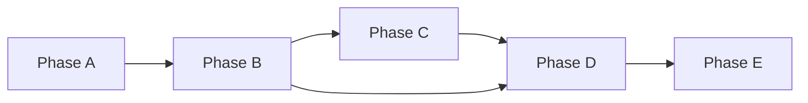

# Implementation Roadmap

## 1. Execution Strategy

Delivery model:

- incremental rollout with hard quality gates
- each phase ends with runnable evidence
- no phase advances with unresolved blocker criteria

## 2. Phase Plan

## Phase A - Scaffolding and Contracts

Goal:

- establish command, skill, plugin skeleton and typed contracts

Tasks:

- add command docs:
  - `src/commands/gsd-auto-validate.md`
  - `src/commands/gsd-auto-validate-status.md`
  - `src/commands/gsd-auto-validate-report.md`
- add skill:
  - `src/skill/gsd-validation/SKILL.md`
  - references for gate policy and report templates
- scaffold plugin module:
  - `src/plugin/gsd-validation-runtime/index.ts`
  - tools folder with stubbed handlers

Exit criteria:

- command help/usage is clear and stable
- plugin tools register successfully
- CI/type checks pass for new module boundaries

## Phase B - Process Lifecycle and Safety

Goal:

- implement run lifecycle and swarm-safe process ownership

Tasks:

- implement `gsd_run_create`
- implement `gsd_server_start`
- implement `gsd_server_wait_ready`
- implement `gsd_server_stop_owned`
- implement ownership validation and process registry

Exit criteria:

- tool can start/stop only owned processes in integration tests
- unowned process is never terminated
- registry persistence survives orchestrator restart

## Phase C - Browser and Observability Pipeline

Goal:

- execute Playwright flows and capture full evidence

Tasks:

- implement `gsd_playwright_execute`
- implement `gsd_logs_collect`
- define default failure patterns and network/console extraction
- integrate visual baseline capture in full mode

Exit criteria:

- failed flow emits screenshots + trace + console/network evidence
- report links all artifacts by runId

## Phase D - Orchestration and HITL Gates

Goal:

- enforce verify -> flow-analyze -> gate -> test pipeline

Tasks:

- add orchestrator logic to `/gsd-auto-validate`
- wire calls to existing `/gsd-verify-work` and `/gsd-analyze-flow`
- implement gap decision gate and branch behavior
- support resume/status/report commands by runId

Exit criteria:

- gaps block automated test path until explicit user decision
- no-gap path runs fully automatic from command entry
- force-test option is explicit and auditable

## Phase E - Hardening and Release

Goal:

- production hardening, observability quality, and docs completeness

Tasks:

- add retry policies and timeout tuning
- add failure-injection tests for server crashes and network errors
- add docs and migration notes
- add runbook for operational usage in swarm environments

Exit criteria:

- acceptance suite green
- docs complete and reviewed
- rollout checklist approved

## 3. Dependency Graph

## 4. Acceptance Test Matrix

| ID    | Scenario                        | Expected Result                             |
| ----- | ------------------------------- | ------------------------------------------- |
| AT-01 | gaps found in flow analysis     | workflow pauses and asks HITL decision      |
| AT-02 | no gaps                         | full test pipeline runs automatically       |
| AT-03 | external server already running | marked as external/reused and never stopped |
| AT-04 | owned server started by run     | process is stopped in teardown              |
| AT-05 | ownership metadata mismatch     | process is skipped with warning             |
| AT-06 | browser console errors          | included in final json + markdown report    |
| AT-07 | failed network requests         | captured and severity-tagged                |
| AT-08 | orchestrator crash mid-run      | `status` command can recover run state      |
| AT-09 | force-test chosen with gaps     | run continues, report marks risk accepted   |
| AT-10 | quick mode                      | minimal but complete evidence set generated |

## 5. Risk Register and Mitigation

| Risk                                          | Impact   | Mitigation                                    |
| --------------------------------------------- | -------- | --------------------------------------------- |
| Over-killing processes in shared environments | Critical | strict ownership validation + no global kills |
| Flaky E2E in CI or local env                  | High     | retry policy + deterministic readiness checks |
| Artifact bloat                                | Medium   | retention policy by run age/size              |
| Tool contract drift                           | Medium   | schema versioning + contract tests            |
| Human gate bypass through defaults            | High     | no implicit defaults for gap decisions        |

## 6. Implementation Task Breakdown (File-Level)

Core files to add/modify:

- `src/plugin/gsd-validation-runtime/index.ts`
- `src/plugin/gsd-validation-runtime/tools/run-create.ts`
- `src/plugin/gsd-validation-runtime/tools/server-start.ts`
- `src/plugin/gsd-validation-runtime/tools/server-wait-ready.ts`
- `src/plugin/gsd-validation-runtime/tools/playwright-execute.ts`
- `src/plugin/gsd-validation-runtime/tools/logs-collect.ts`
- `src/plugin/gsd-validation-runtime/tools/server-stop-owned.ts`
- `src/plugin/gsd-validation-runtime/tools/run-finalize.ts`
- `src/commands/gsd-auto-validate.md`
- `src/commands/gsd-auto-validate-status.md`
- `src/commands/gsd-auto-validate-report.md`
- `src/skill/gsd-validation/SKILL.md`
- `src/skill/gsd-validation/references/gate-policy.md`
- `src/skill/gsd-validation/references/report-template.md`

## 7. Rollout Checklist

- Phase A-E acceptance criteria all satisfied
- manual smoke run on a shared/simulated swarm host
- zero false-positive process kills in validation logs
- command docs published and examples validated
