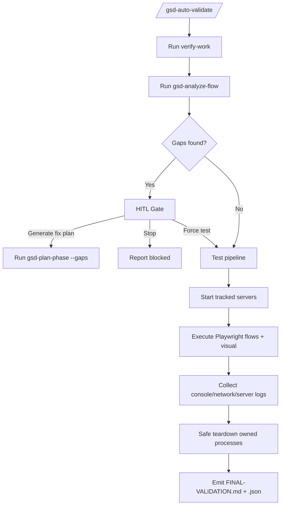

# GSD Ultimate Validation Workflow Plan

## Objective

Automate the post-implementation validation path after `/gsd-verify-work <phase>` by combining:

- gap detection (`/gsd-analyze-flow`)
- human-in-the-loop (HITL) decision gates
- deterministic runtime automation (server control, Playwright, logs, visual checks)
- safe teardown that only stops processes started by the current run

This plan uses OpenCode design patterns:

- thin commands for UX and routing
- plugin tools for deterministic execution and side effects
- skills for policy, rules, and report quality

## Scope

In scope:

- New orchestration command family for automated phase validation
- Runtime plugin with typed tools for process lifecycle, test execution, and artifacts
- HITL gate when flow gaps exist
- Final report with machine-readable + human-readable outputs

Out of scope:

- Auto-fixing product gaps without explicit human approval
- Global process management outside current run ownership
- Replacing existing `/gsd-verify-work` and `/gsd-analyze-flow` internals

## Target Command UX

```text
/gsd-auto-validate <phase> [--quick|--full] [--force-test] [--technical]
/gsd-auto-validate-status <run-id>
/gsd-auto-validate-report <run-id>
```

## High-Level Flow



## Deliverables in This Plan Package

- `ARCHITECTURE.md`: components, lifecycle, diagrams, safety model
- `TOOL-SDK-CONTRACTS.md`: tool APIs, schemas, contracts, failure behavior
- `IMPLEMENTATION-ROADMAP.md`: phased execution, dependencies, acceptance criteria

## Success Criteria

- Gaps gate is enforced before full automated testing (unless human chooses force-test)
- No external/swarm-unrelated servers are terminated
- End-to-end run produces reproducible artifacts and final verdict
- Workflow is resumable by `runId`
