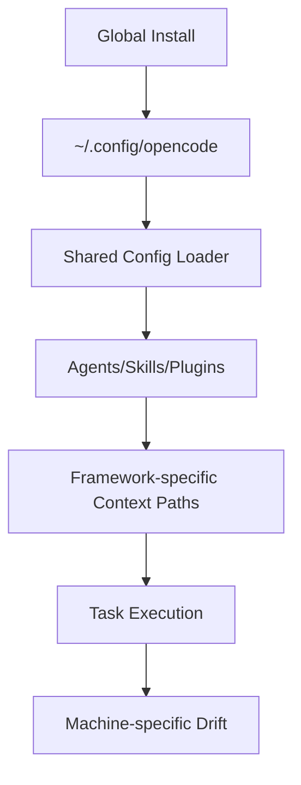
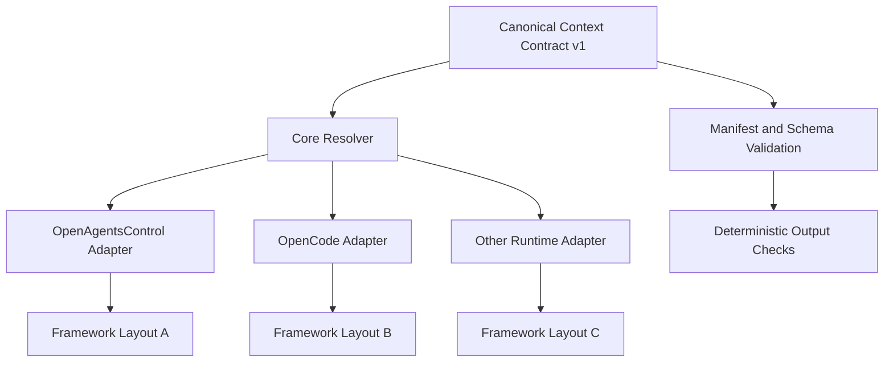
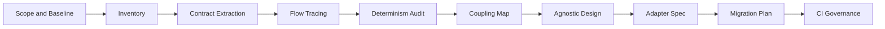

# Framework-Agnostic Context Redesign - Ultra-Grondig Analyseplan

## Doel

Dit plan beschrijft hoe we OpenAgentsControl volledig analyseren en daarna de contextlogica framework-agnostisch redesignen volgens OpenCode design patterns.

Kernproblemen die we adresseren:

- Globale installatie creeert globale state en global-first gedrag.
- Contextstructuur is niet altijd deterministisch over verschillende machines.
- Contextpaden en required files zijn nu gekoppeld aan framework-specifieke agentlogica.
- Contextgebruik is daardoor te weinig portable naar andere orchestrators/runtimes.

## Analyse-uitkomsten (deliverables)

- Complete component inventory van agents, commands, skills, tools, plugins, config en installscripts.
- Contract map met expliciete en impliciete aannames (paden, naming, volgorde, resolutie).
- End-to-end execution traces met side effects en state boundaries.
- Determinisme-audit met machine-vergelijking en drift-oorzaken.
- Coupling scorecard + lock-in analyse.
- Doelarchitectuur voor framework-agnostische context met adapterlaag.
- Migratieplan met backwards compatibility en conformance checks.

## Faseplan

### Fase 0 - Scope en baselines

- Definieer analyse-scope: alle agents, commands, skills, tools, plugins, config en installpaden.
- Kies representatieve omgevingen: minimaal 2-3 machines (bijv. Linux, macOS, Windows/WSL).
- Leg baseline vast: OS, shell, versie, pad-resolutie, globale en lokale installstatus.

### Fase 1 - Inventory en systeemkaart

- Bouw een componentcatalogus met per item:
  - id/type/entrypoint
  - inputs/outputs
  - dependencies
  - side effects
  - contextpath-assumpties
  - permissies/toolrechten
- Gebruik `AGENTS.md` en `docs/opencode/AGENTS.md` als startpunt, daarna code-level validatie.

### Fase 2 - Contract extractie

- Extraheer harde en zachte contracts:
  - hard-coded paden
  - vereiste file-structuren
  - naming-invarianten (zoals `id == name`)
  - model-resolutie en fallback-ketens
- Label elk contract:
  - documented
  - implicit-in-code
  - accidental/legacy

### Fase 3 - Flow analyse (statisch + dynamisch)

- Trace volledige runtimeflow:
  - install
  - config load
  - registraties
  - context generatie
  - taakuitvoering
- Meet waar global state binnenkomt en waar lokale overrides verloren gaan.
- Documenteer preconditions en hidden dependencies.

### Fase 4 - Determinisme audit (multi-PC)

- Voer identieke scenario's uit op meerdere machines.
- Vergelijk output op:
  - structuur (tree)
  - bestandsinhoud (hash)
  - manifest metadata
- Classificeer drift-oorzaken:
  - env variabelen
  - padnormalisatie
  - ontbrekende defaults
  - version skew

### Fase 5 - Coupling en lock-in analyse

- Maak afhankelijkheidskaart tussen core logica en framework-specifieke onderdelen.
- Scoor per component:
  - portability
  - determinism
  - overrideability
  - composability
  - testability
- Prioriteer ontkoppeling op impact en risico.

### Fase 6 - Agnostisch doelmodel (OpenCode-conform)

- Definieer `Context Contract v1`:
  - canoniek schema
  - manifest
  - required/optional capabilities
- Scheid architectuur in:
  - core (framework-onafhankelijk)
  - adapters (framework-specifiek)
- Introduceer path policy:
  - project local first
  - expliciete override
  - optionele globale fallback

### Fase 7 - Adapterarchitectuur

- Ontwerp adapter API voor structuurvertaling per runtime.
- Core produceert alleen canonieke context; adapters mappen naar target-layout.
- Verwijder framework-specifieke paden uit core businesslogica.

### Fase 8 - Migratie en compatibiliteit

- Draai dual-output periode:
  - legacy layout
  - canonical layout
- Bouw migratiecheckers:
  - structurele equivalentie
  - semantische equivalentie
- Plan deprecation in gecontroleerde releases.

### Fase 9 - Governance en CI quality gates

- Verplicht in CI:
  - schema-validatie
  - deterministic generation checks
  - adapter conformance tests
- Definieer releasecriteria: zelfde input geeft zelfde output op alle ondersteunde platforms.

## Multidimensionale analysematrix

Gebruik deze matrix voor elk component (agent/command/skill/tool/plugin):

- Functioneel: klopt gedrag met doel?
- Structureel: klopt outputstructuur met contract?
- Gedragsmatig: side effects en volgorde voorspelbaar?
- Configuratie: gebruikt het shared config correct?
- Portabiliteit: werkt gelijk lokaal en globaal?
- Koppeling: hoeveel framework-specifieke assumpties?
- Determinisme: reproduceerbare output?
- Observability: voldoende logging/tracing/manifest?
- Security/permissies: least-privilege toegepast?
- Evolueerbaarheid: uitbreidbaar zonder breaking changes?

## Diagrammen

### 1) Huidige situatie (lock-in risico)

### 2) Doelarchitectuur (agnostisch met adapters)

### 3) Analysepipeline

## Eerste concrete vervolgstappen

1. Maak een inventory-sheet met alle componenten en contracts.
2. Start met een eerste determinisme-run op twee machines met exact dezelfde input.
3. Breng hard-coded paden en fallback-routes in kaart als prioritaire lock-in punten.
4. Definieer een eerste concept van `Context Contract v1` + adapter boundary.
