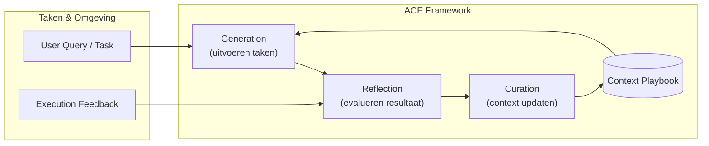
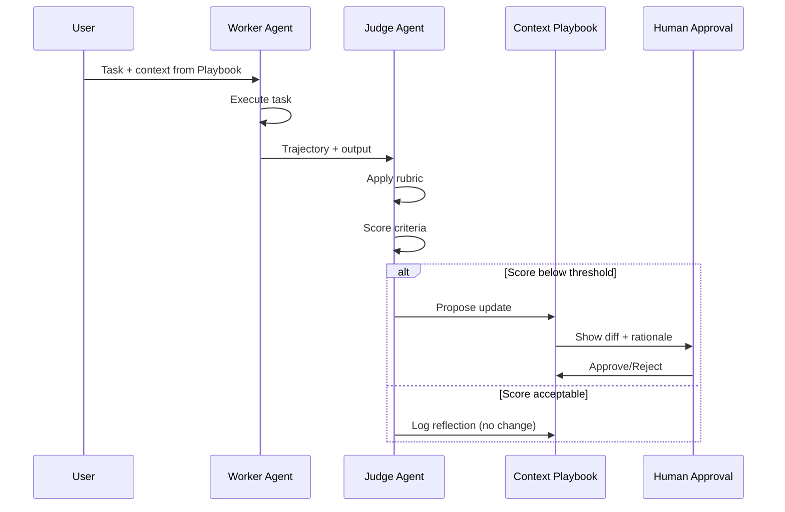
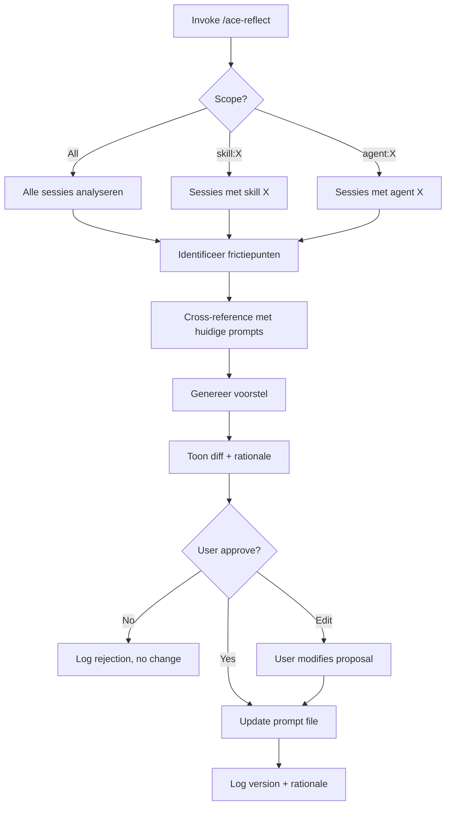

# ACE: Agentic Context Engineering

> _Evolving Contexts for Self-Improving Language Models_

## Wat is ACE?

ACE (Agentic Context Engineering) is een framework waarbij AI-systemen hun eigen context kunnen verbeteren — niet metaforisch, maar letterlijk. In plaats van één perfecte prompt te schrijven, bouw je een **evoluerend playbook** dat continu wordt aangescherpt op basis van echte execution-feedback.

### Kernprincipe

```
Traditional:  Prompt → Pray → Tweak → Repeat
ACE:          Prompt → Execute → Reflect → Curate → Evolve
```

### Bronnen

- **Academic Paper**: Q. Zhang et al., _Agentic Context Engineering: Evolving Contexts for Self-Improving Language Models_, arXiv:2510.04618, 2025
- **Praktische Implementatie**: Geïnspireerd door self-improving chatbot demo (Claude Code + Supabase)

---

## Waarom ACE?

### Problemen met traditionele prompt engineering

| Probleem             | Beschrijving                                                                             |
| -------------------- | ---------------------------------------------------------------------------------------- |
| **Brevity Bias**     | Optimizers streven naar korte, generieke samenvattingen — domein-intelligentie verdwijnt |
| **Context Collapse** | Iteratief herschrijven maakt context korter en abstracter tot kwaliteit instort          |
| **Reactive Only**    | Pas wijzigen als gebruiker klaagt of threshold wordt overschreden                        |

### Wat ACE biedt

| Voordeel                  | Beschrijving                                                                    |
| ------------------------- | ------------------------------------------------------------------------------- |
| **Grow-and-Refine**       | Nieuwe inzichten toevoegen + oude herstructureren (geen brute overschrijvingen) |
| **Proactive Improvement** | Systeem detecteert zelf verbeterpunten                                          |
| **Evidence-Based**        | Wijzigingen gebaseerd op echte conversaties, niet aannames                      |
| **Versioned**             | Altijd terugdraaien als evolutie verkeerd uitpakt                               |

---

## Architectuur

### Hoofdcomponenten



### Component Beschrijvingen

| Component            | Rol                                 | In OpenCode                |
| -------------------- | ----------------------------------- | -------------------------- |
| **Generation**       | Voert taken uit met huidige context | Primary/Sub agents         |
| **Reflection**       | Evalueert output tegen rubric       | Judge agent (LLM as judge) |
| **Curation**         | Beslist over context updates        | User approval gate         |
| **Context Playbook** | Alle prompts, patterns, heuristics  | SKILL.md, context files    |

### Reflection Flow



---

## Strategy

### Wanneer ACE gebruiken?

| Scenario                | ACE Geschikt? | Waarom                           |
| ----------------------- | ------------- | -------------------------------- |
| Multi-step agenten      | ✅ Ja         | Veel trajecten om van te leren   |
| Domein-specifieke taken | ✅ Ja         | Heuristieken evolueren over tijd |
| Simpele één-shots       | ❌ Nee        | Niet genoeg signal               |
| Stabiele requirements   | ❌ Nee        | Evolutie niet nodig              |

### Strategische Principes

1. **Context als evoluerend playbook, niet statische prompt**
   - Groeiende verzameling strategieën, voorbeelden, waarschuwingen
   - Incrementele updates op component-niveau

2. **LLM as Judge met expliciete rubric**
   - "Blanco" agent evalueert worker agent
   - Criteria: completeness, accuracy, efficiency, tone, clarity

3. **Evidence-based updates**
   - Minimaal X conversaties/interacties als basis
   - Threshold-based triggering

4. **Menselijke goedkeuring als guardrail**
   - Alle wijzigingen ter review
   - Rollback capability

---

## Tactics

### Trigger Mechanismen

| Type          | Wanneer                      | Implementatie       |
| ------------- | ---------------------------- | ------------------- |
| **Manual**    | User invoke `/ace-reflect`   | Direct controle     |
| **Threshold** | Na X interacties of Y fouten | Automated detection |
| **Periodic**  | Elk interval (uur, dag)      | Scheduled check     |
| **Hybrid**    | Manual + threshold           | Best of both        |

**Aanbevolen voor OpenCode**: Manual + threshold hints

### Evaluatie Rubric

| Criterium    | Schaal | Trigger voor suggestie |
| ------------ | ------ | ---------------------- |
| Completeness | 1-5    | < 3                    |
| Accuracy     | 1-5    | < 3 (verplicht)        |
| Efficiency   | 1-5    | < 2                    |
| Tone         | 1-5    | < 2                    |
| Clarity      | 1-5    | < 3                    |

**Totaal threshold**: < 15/25 = verplicht voorstel

### Update Workflow



### Feedback Bronnen

| Bron                  | Type      | Detectie                           |
| --------------------- | --------- | ---------------------------------- |
| Error logs            | Impliciet | Bash failures, test failures       |
| User corrections      | Expliciet | "Nee doe anders", herformuleringen |
| Success markers       | Impliciet | "Bedankt", "goed", afgeronde taken |
| Conversation analysis | Impliciet | LLM as judge scoring               |

### Guardrails

```
✅ DO:
- Cooldown period (min. 1 uur tussen updates)
- Version history met rollback
- Multi-criteria evaluation
- Separate judge agent
- Human approval gate

❌ DON'T:
- Elke sessie auto-updaten (instabiliteit)
- Alleen positive feedback accepteren (bias)
- Te generieke feedback ("doe het beter")
- Geen versiebeheer (kan niet terugdraaien)
```

---

## OpenCode Implementatie

### Targets voor evolutie

| Target   | File Type | Locatie                   |
| -------- | --------- | ------------------------- |
| Skills   | SKILL.md  | `.opencode/skill/<naam>/` |
| Agents   | <naam>.md | `.opencode/agents/`       |
| Commands | <naam>.md | `.opencode/commands/`     |
| Context  | \*.md     | `.opencode/context/`      |

### Sessie Opslag

```
~/.local/share/opencode/project/<project-slug>/storage/
```

### Workflow in OpenCode

```bash
# Manual invoke
/ace-reflect

# Scoped invoke
/ace-reflect skill:opencode-mastery
/ace-reflect agent:CoderAgent
/ace-reflect command:meta-agent

# Met tijdframe
/ace-reflect --sessions 5
/ace-reflect --since "2025-02-01"
```

### Output Format

````markdown
## ACE Reflection Report

**Analyzed**: 3 sessions, 47 interactions
**Scope**: skill:opencode-mastery
**Date**: 2025-02-13

### Summary

- ✅ 42 interactions passed
- ⚠️ 5 interactions flagged for improvement

### Findings

#### Issue 1: Overly verbose responses

**Evidence**: Sessions 2, 3 contained user feedback "te lang"
**Current**: SKILL.md section "How I Work"
**Score**: Completeness 4/5, Efficiency 2/5

#### Suggested Change

```diff
- Provide comprehensive explanations for all topics
+ Provide concise explanations with optional deep-dive links
```
````

**Rationale**: Users indicated preference for brevity while maintaining accuracy.

### Actions

- [ ] Review suggested change
- [ ] Approve / Reject / Edit

````

---

## Best Practices

### Voor de Judge Agent

1. **Gebruik een "cleanslate" prompt** — geen bias van worker context
2. **Expliciete criteria** — geen vage "is het goed?"
3. **Evidence requirement** — citeer specifieke interacties
4. **Calibrated thresholds** — niet te streng, niet te mild

### Voor de Curation

1. **Bewaar history** — altijd oude versies beschikbaar
2. **Log rationale** — waarom deze wijziging?
3. **Defer to human** — suggestie, niet auto-apply
4. **Batch related changes** — geen fragmentarische updates

### Voor lange sessies

1. **Baton pass document** — session continuity
2. **Incremental analysis** — niet alles in één keer
3. **Context pruning** — behoud alleen relevante signal

---

## Voorbeeld: Baton Pass Template

```markdown
# ACE Session Handoff

## Completed
- [x] Initial SKILL.md analysis
- [x] Rubric definition
- [ ] Script implementation

## Key Findings
- Completeness scores consistent 4-5
- Efficiency scores lagging (avg 2.3)
- User feedback: "te veel stappen"

## Next Session Focus
- Implement efficiency improvements
- Test with new threshold

## Files Modified
- references/ace-framework.mdx (created)
- references/ace-rubric.mdx (created)

## Open Questions
- Should we add "brevity" as separate criterion?
````

---

## Referenties

### Gerelateerde Documenten

- [ACE Rubric](./ace-rubric.mdx) — Evaluatie criteria details
- [ACE Patterns](./ace-patterns.mdx) — Success en anti-patterns

### Externe Bronnen

- [arXiv:2510.04618](https://arxiv.org/abs/2510.04618) — ACE Academic Paper
- OpenCode Documentation — `~/.ai_docs/opencode/docs/`

---

## Samenvatting

> In plaats van één perfecte prompt, bouwt ACE een **levend context-playbook** dat continu wordt aangevuld en aangescherpt via agentische generatie, reflectie en curatie, gestuurd door echte execution-feedback.

**Kernflow**: Execute → Reflect → Curate → Evolve
**Kernprincipe**: Context evolueert, model weights blijven vast
**Kerngarde**: Human approval gate + version control
