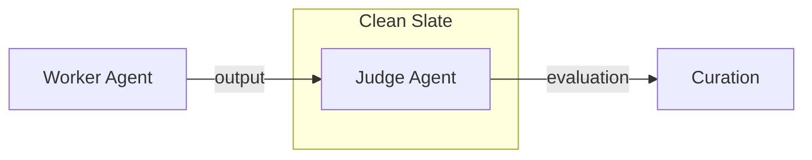
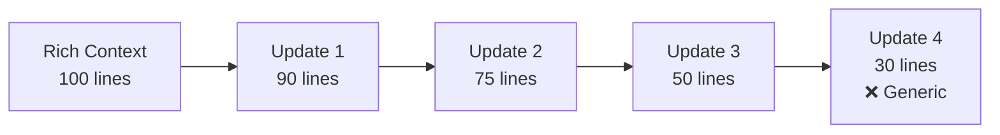

# ACE Patterns

Deze documentatie bevat success patterns, anti-patterns en implementation patterns voor ACE systemen.

---

## Success Patterns

### Pattern: Separate Judge Agent

**Context**: Evaluatie van worker agent output

**Probleem**: Zelf-evaluatie is beïnvloed door context en ego

**Oplossing**: Gebruik een aparte "cleanslate" agent puur voor evaluatie



**Implementatie**:

- Judge heeft GEEN toegang tot worker's interne redenering
- Judge krijgt alleen: task + output + user feedback
- Judge prompt is expliciet neutraal

### Pattern: Evidence-Based Suggestions

**Context**: Voorstellen voor prompt verbetering

**Probleem**: Vage suggesties ("doe het beter") leiden tot geen verbetering

**Oplossing**: Elke suggestie MOET evidence bevatten

```
Voorbeeld GOED:
- Issue: Responses te lang
- Evidence: Session 3 msg 7: user says "te langdradig"
- Evidence: Session 5 msg 2: user asks for "korte samenvatting"
- Suggestie: Voeg "Wees beknopt" toe aan instructies

Voorbeeld FOUT:
- Issue: Responses kunnen beter
- Suggestie: Verbeter kwaliteit
```

### Pattern: Cooldown Period

**Context**: Frequentie van prompt updates

**Probleem**: Over-reactive updates maken systeem instabiel

**Oplossing**: Minimum tijd tussen updates

```python
# Cooldown configuratie
MIN_UPDATE_INTERVAL = timedelta(hours=1)  # Minimum
RECOMMENDED_INTERVAL = timedelta(hours=24)  # Aanbevolen

def can_update(last_update_time):
    return datetime.now() - last_update_time >= MIN_UPDATE_INTERVAL
```

**Waarom werkt dit**:

- Voorkomt "knee-jerk" reacties op enkele slechte interacties
- Geeft tijd om meer evidence te verzamelen
- Stabiliseert systeemgedrag

### Pattern: Version History + Rollback

**Context**: Prompt evolutie over tijd

**Probleem**: Updates kunnen averechts werken

**Oplossing**: Alle versies bewaren met rollback capability

```
versions/
├── v1_initial.md
├── v2_added_brevity.md
├── v3_fixed_tone.md
└── v4_current.md

# Rollback
/ace-rollback --to v2_added_brevity.md
```

**Metadata per versie**:

- Timestamp
- Trigger (welke sessie/evidence)
- Changes summary
- Rationale
- Approval user

### Pattern: Threshold-Based Triggers

**Context**: Wanneer actie ondernemen

**Probleem**: Elke interactie analyseren is inefficiënt

**Oplossing**: Definieer duidelijke thresholds

| Metric                 | Threshold     | Actie              |
| ---------------------- | ------------- | ------------------ |
| Accuracy < 3           | 1 occurrence  | Verplicht review   |
| Total score < 3        | 3 sessions    | Verplicht voorstel |
| Same issue pattern     | 3 occurrences | Suggestie          |
| User negative feedback | 2 occurrences | Review             |

### Pattern: Baton Pass

**Context**: Lange multi-sessie development

**Probleem**: Context window raakt vol, informatie gaat verloren

**Oplossing**: Session handoff document

```markdown
# ACE Session Handoff

## Completed

- [x] Initial analysis
- [x] Rubric definition
- [ ] Implementation

## Key Findings

- Issue A: frequent (5x)
- Issue B: occasional (2x)

## Next Session

1. Focus on Issue A
2. Test with new rubric

## Files Modified

- references/ace-framework.mdx
- references/ace-rubric.mdx

## Open Questions

- Add "brevity" as criterion?
```

---

## Anti-Patterns

### Anti-Pattern: Brevity Bias

**Probleem**: Optimizers streven naar korte, generieke samenvattingen

**Gevolg**: Domein-intelligentie verdwijnt

```
VOOR (rijk):
"Gebruik de --verbose flag voor gedetailleerde output,
--quiet voor alleen errors, of --json voor machine-readable output."

NA (brevity bias):
"Gebruik flags voor output controle."
```

**Hoe te voorkomen**:

- Expliciet in rubric: "Completeness > Efficiency"
- Evidence-check: verwijderde info relevant?
- Score "Specificity" als apart criterium

### Anti-Pattern: Context Collapse

**Probleem**: Iteratief herschrijven maakt context korter en abstracter

**Probleem**: Na meerdere updates is kwaliteit ingestort



**Hoe te voorkomen**:

- GROW-en-refine, niet replace
- Bewaar originele details
- Check: "is er info verwijderd die nuttig was?"
- Track context length over time

### Anti-Pattern: Nice Judge

**Probleem**: Judge agent is "te aardig" en geeft hoge scores

**Gevolg**: Geen verbetering, systeem stagneert

```
Typical nice judge scores:
- Completeness: 5/5
- Accuracy: 5/5
- Efficiency: 4/5
- Tone: 5/5
- Clarity: 5/5
Total: 4.8/5.0 (no change needed)
```

**Hoe te voorkomen**:

- Impliciete instructie: "Your standards are high"
- Calibration set: bekende problemen moeten lage scores geven
- Human spot-check: valideer judge scores periodiek

### Anti-Pattern: Reactive Only

**Probleem**: Pas wijzigen als gebruiker expliciet klaagt

**Gevolg**: Veel kleine problemen blijven bestaan

**Hoe te voorkomen**:

- Proactive analysis: analyseer ook zonder klachten
- Subtle signals: detecteer "te lang" zonder dat gebruiker zegt
- Periodic review: scheduled reflection loops

### Anti-Pattern: Auto-Apply

**Probleem**: Updates automatisch doorvoeren zonder review

**Gevolg**: Foute updates, instabiliteit, vertrouwensverlies

**Hoe te voorkomen**:

- ALTIJD human approval gate
- Toon diff + rationale
- Vraag: Approve / Reject / Edit
- Log alle beslissingen

### Anti-Pattern: Single Signal Decisions

**Probleem**: Beslissing op basis van één interactie

**Gevolg**: Over-reactive, instabiel systeem

```
FOUT:
- Session 1 msg 3: user says "te kort"
- Action: Update prompt immediately

GOED:
- Session 1 msg 3: user says "te kort"
- Session 2 msg 1: user says "te kort"
- Session 3 msg 5: user says "meer detail"
- Pattern detected: 3x same issue
- Action: Propose update
```

---

## Implementation Patterns

### Pattern: Two-Source System

**Context**: Documentatie organisatie

**Oplossing**: Official docs + Custom references gescheiden

```
Official Docs (read-only):
~/.ai_docs/opencode/docs/
├── skills.mdx
├── agents.mdx
└── ...

Custom References (editable):
.opencode/skill/opencode-mastery/references/
├── registry.json
├── ace-framework.mdx
└── ace-rubric.mdx
```

**Voordeel**:

- Official docs kunnen geüpdatet worden zonder custom refs te verliezen
- Custom refs zijn version-controlled in project
- Clear separation of concerns

### Pattern: Registry-Based Discovery

**Context**: Custom references vinden

**Oplossing**: Registry JSON met keywords en metadata

```json
{
  "entries": [
    {
      "id": "ace-framework",
      "filename": "ace-framework.mdx",
      "keywords": ["ace", "self-improvement", "reflection"],
      "category": "ace"
    }
  ]
}
```

**Gebruik**:

- Fuzzy search op keywords
- Category filtering
- Metadata tracking

### Pattern: Script as Tool

**Context**: ACE functionaliteit automatiseren

**Oplossing**: Python script met CLI interface

```bash
# Analyze sessions
uv run ace-reflector.py --analyze --sessions 5

# Generate suggestions
uv run ace-reflector.py --suggest --scope skill:opencode-mastery

# Apply approved change
uv run ace-reflector.py --apply --proposal ./proposals/001.md
```

**SOLID toepassing**:

- Single Responsibility: elk command één taak
- Interface Segregation: losse subcommands
- Dependency Inversion: config via argparse, niet hardcoded

---

## Decision Matrix

### Wanneer ACE updaten?

| Signal                 | Frequency  | Action             |
| ---------------------- | ---------- | ------------------ |
| Accuracy < 3           | 1x         | Verplicht review   |
| User negative feedback | 2x         | Review             |
| Same issue pattern     | 3x         | Voorstel genereren |
| Total score < 3        | 3 sessions | Verplicht voorstel |
| Total score 3-4        | 5 sessions | Optioneel voorstel |

### Wanneer NIET updaten?

| Signal                     | Action                   |
| -------------------------- | ------------------------ |
| Cooldown niet verstreken   | Wachten                  |
| Slechts 1 occurrence       | Meer evidence verzamelen |
| Score > 4                  | Alleen loggen            |
| User zegt expliciet "goed" | Geen actie               |

---

## Quick Reference Card

```
✅ DO:
├── Separate judge agent (cleanslate)
├── Evidence-based suggestions
├── Cooldown period (min 1 uur)
├── Version history + rollback
├── Threshold-based triggers
├── Human approval gate
├── Grow-and-refine (not replace)
└── Baton pass for long sessions

❌ DON'T:
├── Brevity bias (keep specificity)
├── Context collapse (track length)
├── Nice judge (calibrate)
├── Reactive only (be proactive)
├── Auto-apply (always review)
└── Single signal decisions (need evidence)
```

---

## Referenties

- [ACE Framework](./ace-framework.mdx) — Hoofddocument
- [ACE Rubric](./ace-rubric.mdx) — Evaluatie criteria
