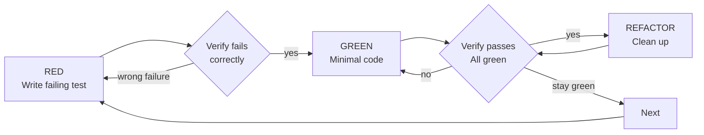

# RED-GREEN-REFACTOR Cycle

## Overview

The TDD cycle consists of three phases that must be followed in order:



## RED - Write Failing Test

Write one minimal test showing what should happen.

**Good Example:**

```typescript
test("retries failed operations 3 times", async () => {
  let attempts = 0;
  const operation = () => {
    attempts++;
    if (attempts < 3) throw new Error("fail");
    return "success";
  };

  const result = await retryOperation(operation);

  expect(result).toBe("success");
  expect(attempts).toBe(3);
});
```

_Clear name, tests real behavior, one thing_

**Bad Example:**

```typescript
test("retry works", async () => {
  const mock = jest
    .fn()
    .mockRejectedValueOnce(new Error())
    .mockRejectedValueOnce(new Error())
    .mockResolvedValueOnce("success");
  await retryOperation(mock);
  expect(mock).toHaveBeenCalledTimes(3);
});
```

_Vague name, tests mock not code_

**Requirements:**

- One behavior
- Clear name
- Real code (no mocks unless unavoidable)

## Verify RED - Watch It Fail

**MANDATORY. Never skip.**

```bash
npm test path/to/test.test.ts
```

**Confirm:**

- Test fails (not errors)
- Failure message is expected
- Fails because feature missing (not typos)

**Test passes?** You're testing existing behavior. Fix test.

**Test errors?** Fix error, re-run until it fails correctly.

## GREEN - Minimal Code

Write simplest code to pass the test.

**Good Example:**

```typescript
async function retryOperation<T>(fn: () => Promise<T>): Promise<T> {
  for (let i = 0; i < 3; i++) {
    try {
      return await fn();
    } catch (e) {
      if (i === 2) throw e;
    }
  }
  throw new Error("unreachable");
}
```

_Just enough to pass_

**Bad Example:**

```typescript
async function retryOperation<T>(
  fn: () => Promise<T>,
  options?: {
    maxRetries?: number;
    backoff?: "linear" | "exponential";
    onRetry?: (attempt: number) => void;
  },
): Promise<T> {
  // YAGNI - over-engineered
}
```

**Rules:**

- Don't add features
- Don't refactor other code
- Don't "improve" beyond the test

## Verify GREEN - Watch It Pass

**MANDATORY.**

```bash
npm test path/to/test.test.ts
```

**Confirm:**

- Test passes
- Other tests still pass
- Output pristine (no errors, warnings)

**Test fails?** Fix code, not test.

**Other tests fail?** Fix now.

## REFACTOR - Clean Up

After green only:

- Remove duplication
- Improve names
- Extract helpers

**Keep tests green. Don't add behavior.**

## Repeat

Next failing test for next feature.

## Common Rationalizations

| Excuse                                 | Reality                                                                 |
| -------------------------------------- | ----------------------------------------------------------------------- |
| "Too simple to test"                   | Simple code breaks. Test takes 30 seconds.                              |
| "I'll test after"                      | Tests passing immediately prove nothing.                                |
| "Tests after achieve same goals"       | Tests-after = "what does this do?" Tests-first = "what should this do?" |
| "Already manually tested"              | Ad-hoc ≠ systematic. No record, can't re-run.                           |
| "Deleting X hours is wasteful"         | Sunk cost fallacy. Keeping unverified code is technical debt.           |
| "Keep as reference, write tests first" | You'll adapt it. That's testing after. Delete means delete.             |
| "Need to explore first"                | Fine. Throw away exploration, start with TDD.                           |
| "Test hard = design unclear"           | Listen to test. Hard to test = hard to use.                             |
| "TDD will slow me down"                | TDD faster than debugging. Pragmatic = test-first.                      |
| "Manual test faster"                   | Manual doesn't prove edge cases. You'll re-test every change.           |
| "Existing code has no tests"           | You're improving it. Add tests for existing code.                       |

## Why Order Matters

**"I'll write tests after to verify it works"**

Tests written after code pass immediately. Passing immediately proves nothing:

- Might test wrong thing
- Might test implementation, not behavior
- Might miss edge cases you forgot
- You never saw it catch the bug

**Test-first forces you to see the test fail, proving it actually tests something.**

## Final Rule

```
Production code → test exists and failed first
Otherwise → not TDD
```

No exceptions.
